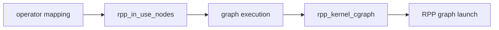
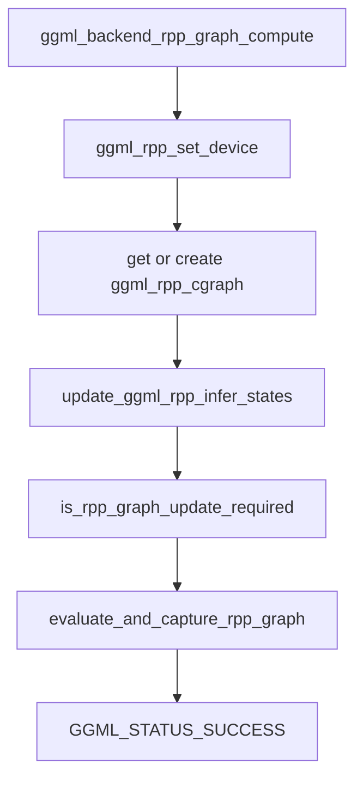
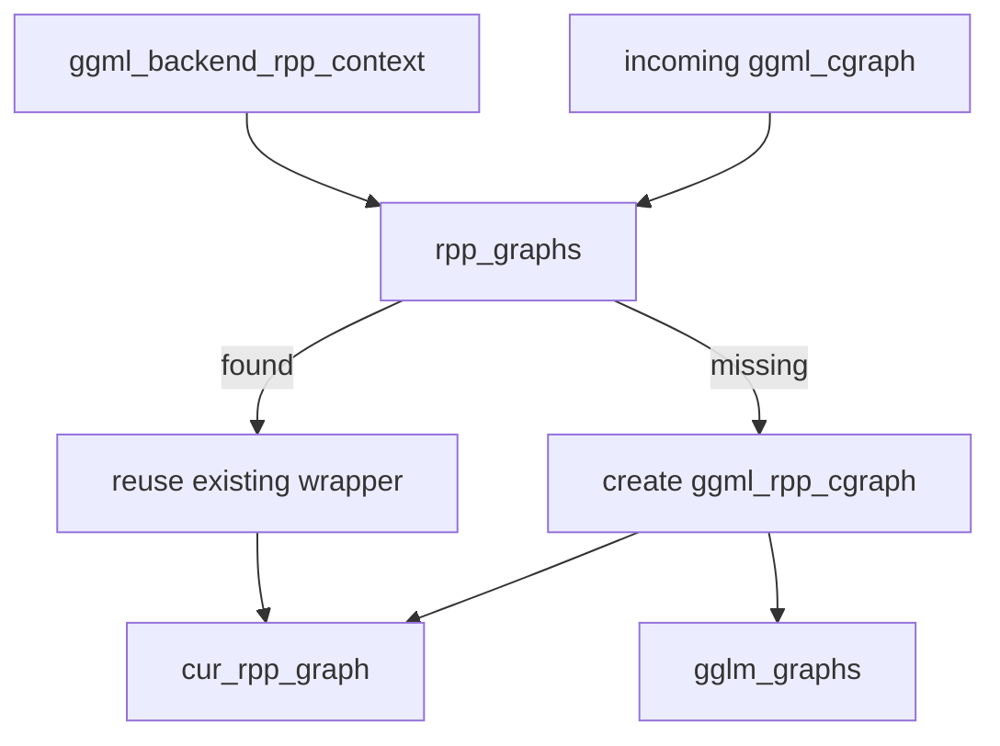
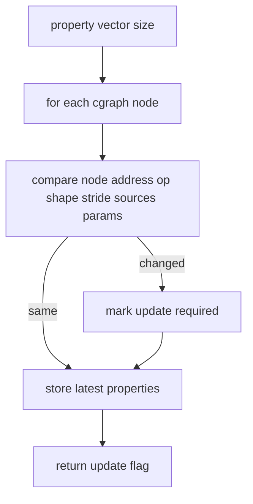
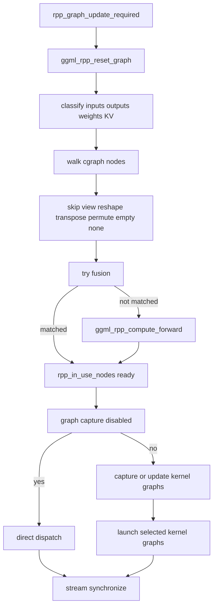
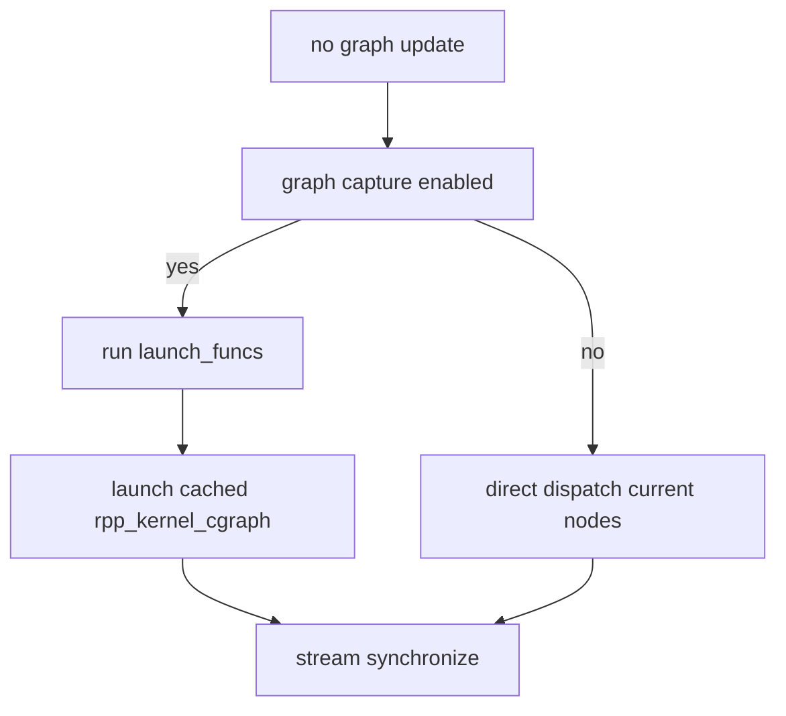
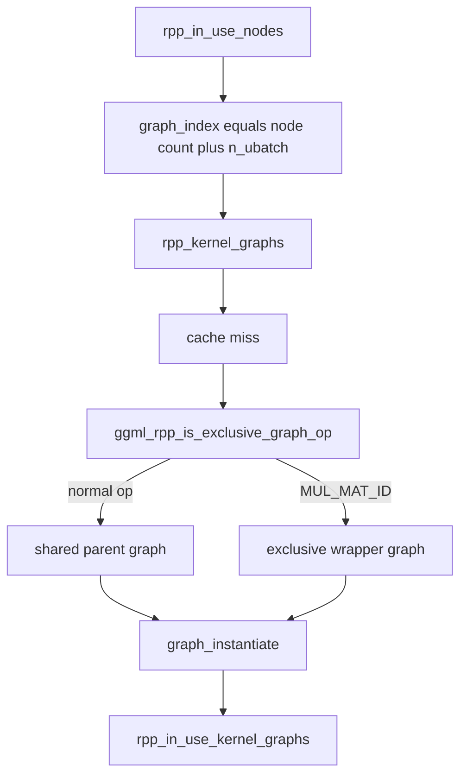
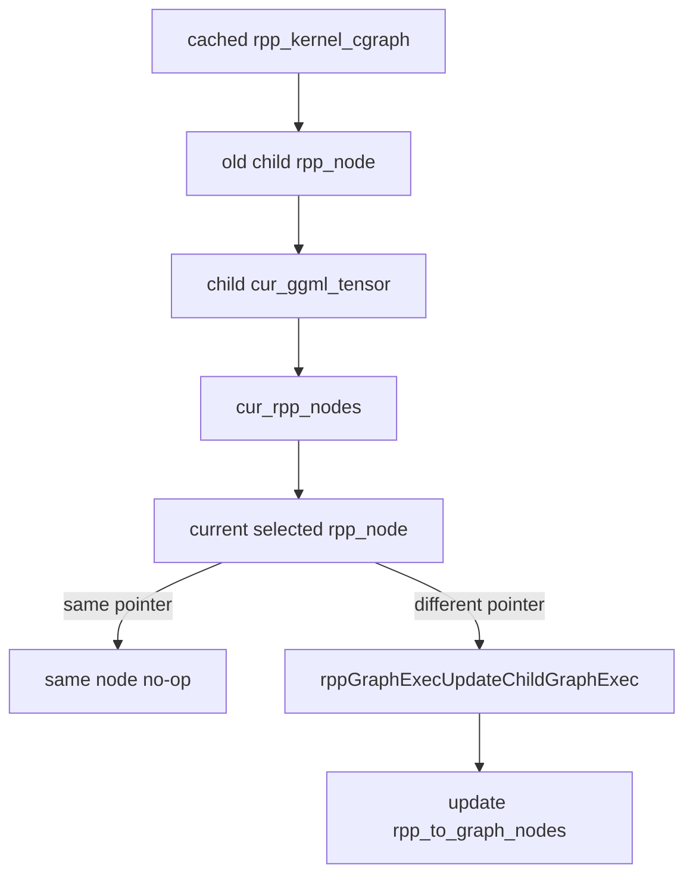
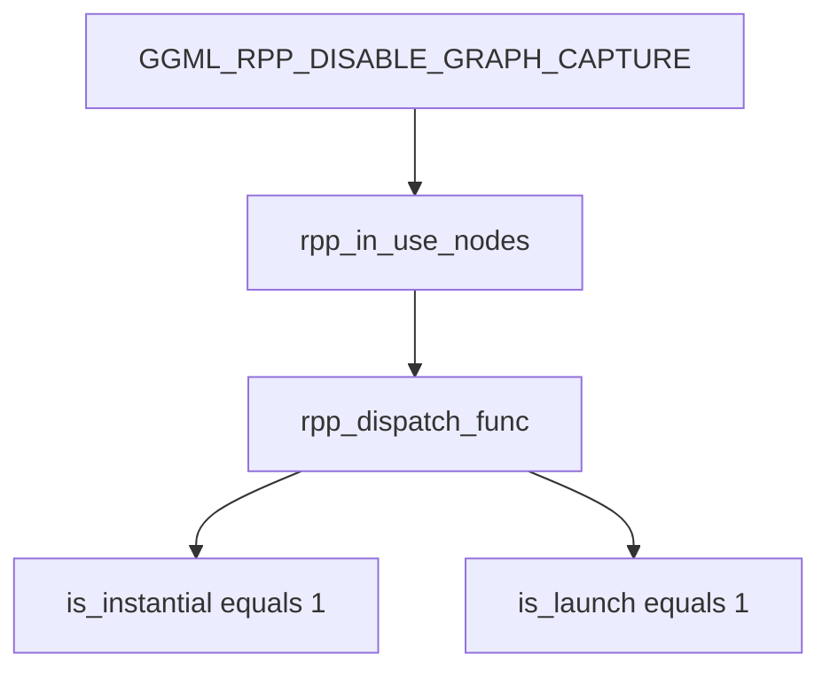
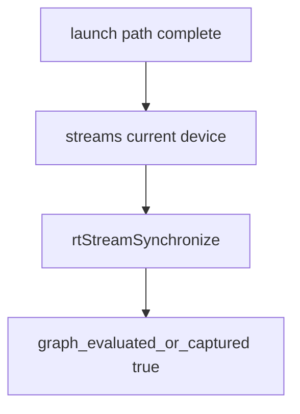

# RPP graph execution

This document explains how the RPP backend executes a GGML graph after operator mapping has selected the current
`ggml_rpp_node` instances. For node selection and reuse rules, see [RPP operator mapping](rpp_operator_mapping.md).

- [Scope](#scope)
- [Execution entry point](#execution-entry-point)
- [Graph wrapper cache](#graph-wrapper-cache)
- [Graph update decision](#graph-update-decision)
- [Rebuild and capture path](#rebuild-and-capture-path)
- [Replay path](#replay-path)
- [Shared and exclusive kernel graphs](#shared-and-exclusive-kernel-graphs)
- [Child graph update](#child-graph-update)
- [Direct dispatch mode](#direct-dispatch-mode)
- [Synchronization and diagnostics](#synchronization-and-diagnostics)

## Scope

`rpp_operator_mapping.md` answers: which RPP node implements a GGML node?

This document answers: how are the selected RPP nodes captured, updated, launched, and synchronized?



## Execution entry point

Graph execution starts from `ggml_backend_rpp_graph_compute()`.



The entry point does not directly launch kernels. It prepares the backend state, decides whether the RPP-side graph
must be rebuilt, then delegates to `evaluate_and_capture_rpp_graph()`.

## Graph wrapper cache

The backend context caches one `ggml_rpp_cgraph` wrapper per `ggml_cgraph *`.



The wrapper persists across launches. It owns:

- historical RPP nodes in `rpp_nodes`
- current launch mapping in `cur_rpp_nodes`
- captured RPP kernel graphs in `rpp_kernel_graphs`
- current graph properties in `ggml_graph_properties`

## Graph update decision

`is_rpp_graph_update_required()` compares the current GGML graph with the previous property snapshot.



The graph is rebuilt when:

- the number of GGML nodes changes
- a node data pointer changes
- op type changes
- shape or stride changes
- source tensor data pointers change
- selected op params change, for example `GGML_OP_SCALE`

`update_ggml_rpp_infer_states()` also clears `cur_rpp_nodes` across cached graphs when the first node changes. This is
how prefill/decode-like transitions force node re-selection.

## Rebuild and capture path

When the graph must be rebuilt, `evaluate_and_capture_rpp_graph()` clears current graph state, classifies tensors, maps
or fuses nodes, then captures or directly launches the selected RPP nodes.



Tensor classification fills:

- `nodes_i`: inputs whose sources are outside the cgraph
- `nodes_o`: graph outputs not consumed later
- `nodes_matmul_weight`: external matmul weights
- `nodes_mul_weight`: external multiply weights
- `nodes_cache_kv`: KV-cache tensors

Operator mapping fills `cur_rpp_nodes` and appends selected nodes to `rpp_in_use_nodes`. The graph execution layer then
turns `rpp_in_use_nodes` into launchable `rpp_kernel_cgraph` instances.

## Replay path

When no graph update is required, `evaluate_and_capture_rpp_graph()` skips node rebuilding. It uses the previously
selected `rpp_in_use_kernel_graphs` and only reruns deferred launch functions before graph launch.



This path is the reason captured graph state must be updated carefully when the selected RPP node changes.

## Shared and exclusive kernel graphs

RPP graph capture groups per-op kernel graphs into `rpp_kernel_cgraph`.



Shared graph:

- owns a parent `RPPgraph`
- calls `rpp_node_kernel::add_to_parent_node()`
- launches with `RPP_LAUNCH_KERNEL(graphexec, stream)`

Exclusive graph:

- wraps one already-instantiated per-op graph
- currently used for `GGML_OP_MUL_MAT_ID`
- launches by calling the node's `rpp_dispatch_func()` from `graph_launch()`

## Child graph update

On a graph-cache hit, the backend does not rebuild the parent graph. It calls
`rpp_kernel_cgraph::update_child_graph(cur_rpp_nodes)`.



For shared parent graphs, the update path replaces child graph exec bindings through
`rppGraphExecUpdateChildGraphExec()`. The parent graph exec remains alive, while the child binding points at the newly
selected kernel node.

For exclusive graphs, the wrapper updates its `graph`, `graphexec`, node pointer, and node-to-graph map to match the
new selected node.

## Direct dispatch mode

Set `GGML_RPP_DISABLE_GRAPH_CAPTURE=1` to bypass captured graph execution.



In direct mode, every selected node is called as:

```text
rpp_dispatch_func(ctx, cur_ggml_tensor, 1, 1)
```

This mode is useful when debugging graph capture or child graph replacement, because it keeps operator mapping intact
but removes parent graph replay from the execution path.

## Synchronization and diagnostics

After rebuild, replay, or direct dispatch, the backend synchronizes all streams created for the active device.



Useful switches:

| Switch | Effect |
| --- | --- |
| `GGML_RPP_DISABLE_GRAPH_CAPTURE=1` | Disable graph capture/replay and use direct dispatch. |
| `GGML_RPP_DISABLE_FUSION=1` | Disable fusion before operator mapping. |
| `GGML_RPP_DUMP_OPS=ON` | Dump the GGML graph op list and dot graph, then exit graph compute. |
| `GGML_RPP_PERF_TRACE=ON` | Enable Perfetto trace windows around selected graph execution phases. |

When debugging graph execution:

1. Confirm whether `is_rpp_graph_update_required()` rebuilds or replays.
2. Check whether fusion changed the node sequence before `ggml_rpp_compute_forward()`.
3. Inspect `rpp_in_use_nodes` before graph capture.
4. Check the `graph_index` derived from node count and `n_ubatch`.
5. For stale outputs, inspect `update_child_graph()` and `rpp_to_graph_nodes`.
6. Compare captured mode against `GGML_RPP_DISABLE_GRAPH_CAPTURE=1`.
