# RPP memory management

This document explains how the RPP backend manages model weights, GGML tensors, `tensor->data`, temporary IO buffers,
memory pools, split tensors, and per-kernel workspaces.

- [Memory layers](#memory-layers)
- [Backend buffer types](#backend-buffer-types)
- [`tensor->data` ownership](#tensordata-ownership)
- [Weight upload and conversion](#weight-upload-and-conversion)
- [Weight cache](#weight-cache)
- [Runtime tensor IO](#runtime-tensor-io)
- [Memory pools](#memory-pools)
- [Split tensor memory](#split-tensor-memory)
- [Kernel workspace](#kernel-workspace)
- [SRAM lifecycle](#sram-lifecycle)
- [Lifetime and reset](#lifetime-and-reset)
- [Debugging checklist](#debugging-checklist)

## Memory layers

RPP memory management is split across three layers:

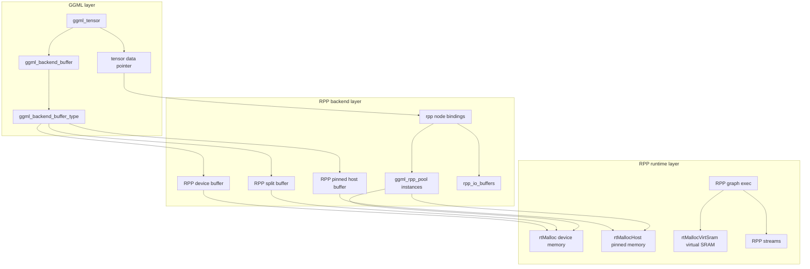

GGML controls tensor allocation through backend buffer interfaces. The RPP backend provides those interfaces and maps
GGML-visible tensors to RPP runtime memory.

## Backend buffer types

The RPP backend exposes three buffer type families:

| Buffer type | Main API | Backing memory | Typical use |
| --- | --- | --- | --- |
| Device buffer | `ggml_backend_rpp_buffer_type(device)` | `rtMalloc` | Regular RPP tensors and most model weights. |
| Host buffer | `ggml_backend_rpp_host_buffer_type()` | `rtMallocHost`, with CPU fallback | Pinned host staging for faster CPU to device transfers. |
| Split buffer | `ggml_backend_rpp_split_buffer_type(main_device, tensor_split)` | Per-device `rtMalloc` in `tensor->extra` | Row-split matrix weights across multiple RPP devices. |

Device buffers use `ggml_backend_rpp_buffer_context`. The context stores:

- `device`: the RPP device that owns the allocation.
- `dev_ptr`: the base pointer allocated with `rtMalloc`.
- `name`: the buffer name shown to GGML.

The buffer interface then implements:

- `get_base`: returns `dev_ptr`.
- `init_tensor`: initializes padding and handles views.
- `set_tensor`: uploads data and converts matmul weights when needed.
- `get_tensor`: copies device data back to host.
- `cpy_tensor`: performs device-to-device copy when source and destination are on the same RPP device.
- `clear` and `memset_tensor`: fill device memory through RPP runtime calls.

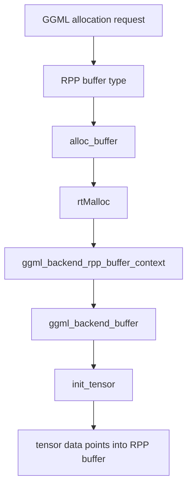

## `tensor->data` ownership

For normal RPP device buffers, `tensor->data` is a device pointer inside the allocation owned by
`ggml_backend_rpp_buffer_context`. It is not host memory. All reads and writes must go through RPP runtime copies or
kernel launches.

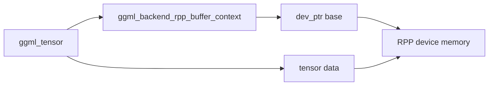

Important cases:

- Normal tensor: `tensor->data` points to device memory allocated by the RPP backend buffer.
- View tensor: `init_tensor` validates that the view source uses the same buffer type and leaves ownership with the
  source allocation.
- Quantized tensor: `init_tensor` zeroes padded bytes when the RPP allocation is larger than the logical tensor size.
- Split tensor: `tensor->data` is not the real per-device pointer. The real pointers live in `tensor->extra`.

The device buffer reports `128` byte alignment. Quantized tensors with `ne[0]` not aligned to `MATRIX_ROW_PADDING`
receive extra padded row storage to avoid out-of-bounds accesses in kernels.

## Weight upload and conversion

Model weights arrive through `ggml_backend_rpp_buffer_set_tensor()`. This function is the main place where host GGML
weight data is converted into the layout expected by RPP kernels.

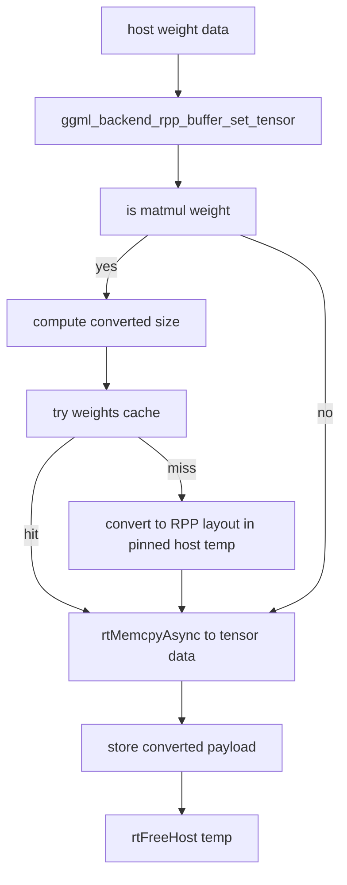

For matmul weights, RPP may convert and repack data before upload. Examples include:

- `F32`, `F16`, and `BF16` weights converted into padded BF16 tiles.
- `Q8_0`, `Q6_K`, `Q5_K`, `Q4_K`, `Q4_1`, `IQ3_XXS`, `IQ2_S`, and `IQ2_XS` converted into RPP kernel-specific
  packed layouts.
- Expert weights handled as repeated per-expert slices using `tensor->ne[2]`.

The conversion path allocates a temporary pinned host buffer with `rtMallocHost`, writes converted data into it, then
copies it into `tensor->data` using `rtMemcpyAsync(..., rtMemcpyHostToDevice, rtStreamPerThread)`.

The allocation-size function `ggml_backend_rpp_buffer_type_get_alloc_size()` mirrors this behavior. If a matmul weight
has a converted size, it reports at least the logical tensor size and enough space for the converted payload. For
quantized tensors it also adds row padding when needed.

## Weight cache

The RPP weight cache is enabled by setting `GGML_RPP_WEIGHTS_CACHE_FILE`.

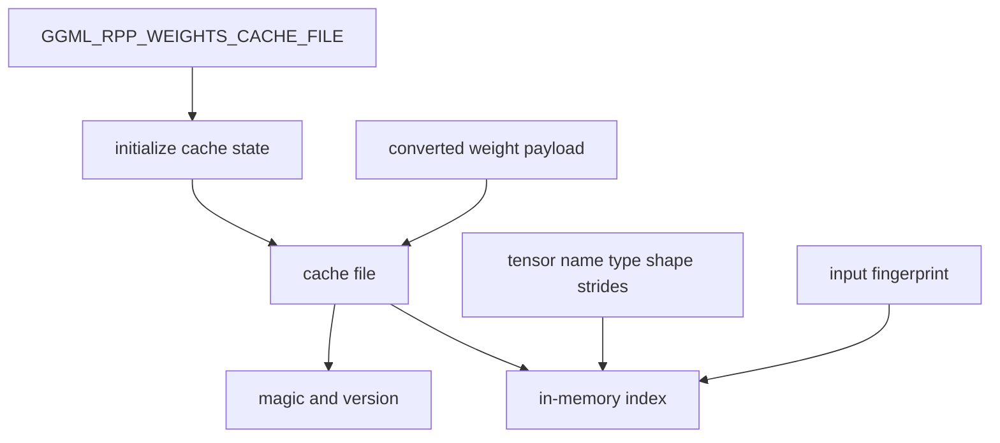

Cache entries are keyed by:

- tensor name
- tensor type
- shape (`ne`)
- strides (`nb`)

The cache also stores input size, output size, and a fingerprint of the original input bytes. A cache hit is accepted
only when the key, input size, output size, and fingerprint all match. The cached payload is copied into a temporary
pinned host buffer and then uploaded to `tensor->data`.

The cache file starts with `RPPWC01` magic and a cache version. If the header is missing or invalid, the file is reset.

## Runtime tensor IO

During graph execution, RPP nodes bind GGML tensors to concrete device buffers:

| Field | Meaning |
| --- | --- |
| `binding_i_buffers` | Input tensor to device buffer pointer mapping. |
| `binding_o_buffers` | Output tensor to device buffer pointer mapping. |
| `binding_io_tensors` | Ordered tensor list used by op-specific setup. |
| `binding_io_buffers` | Ordered buffer list passed to kernel graph builders. |
| `pool_buffers` | Temporary buffers allocated from backend pools and owned by the node. |
| `rpp_io_buffers` | Backend-level cache for temporary IO buffers by `ggml_tensor *`. |

For contiguous inputs, bindings often point directly at `src->data` or `dst->data`. For non-contiguous inputs, an op can
allocate a temporary contiguous buffer from `ctx.pool()` and pack the tensor into that buffer before launch.

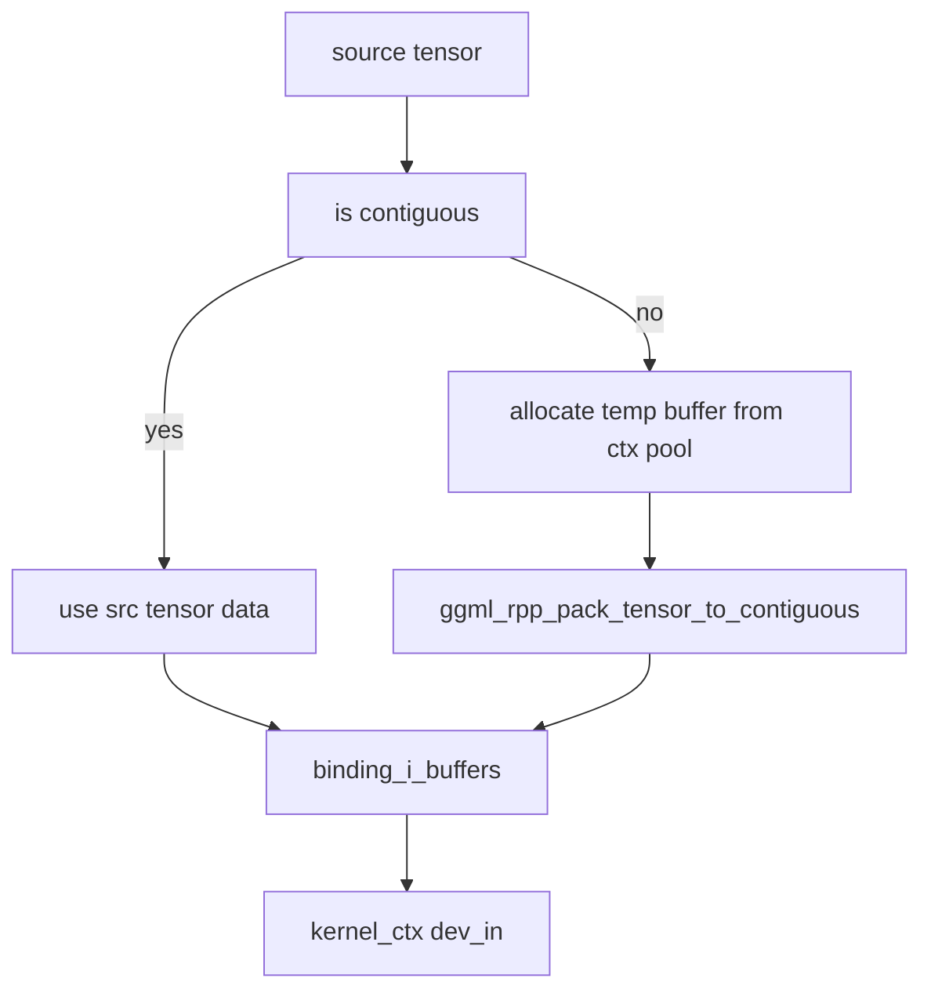

`ggml_rpp_reset_node()` clears stale per-node IO bindings and frees pool-backed buffers when a node is reset. A full
graph reset clears `cur_rpp_nodes`, classified node sets, `rpp_in_use_nodes`, `rpp_in_use_kernel_graphs`, and
`launch_funcs`.

## Memory pools

All pool implementations inherit from `ggml_rpp_pool`. The backend context exposes lazy per-device and per-host pools:

| Context accessor | Implementation | Backing memory |
| --- | --- | --- |
| `pool()` / `pool(device)` | `ggml_rpp_pool_map` | Device memory from `rtMalloc`. |
| `pool_host()` / `pool_host(device)` | `ggml_rpp_pool_map` | Host memory from `rtMallocHost`. |
| `pool_leg()` | `ggml_rpp_pool_leg` | Device memory with fixed-size slot cache. |
| `pool_host_leg()` | `ggml_rpp_pool_leg` | Host memory with fixed-size slot cache. |
| `pool_mem()` | `ggml_rpp_pool_mem` | Device memory from a preallocated arena. |
| `pool_host_mem()` | `ggml_rpp_pool_mem` | Host memory from a preallocated arena. |

### `ggml_rpp_pool_map`

This is the default pool used by `pool()` and `pool_host()`.

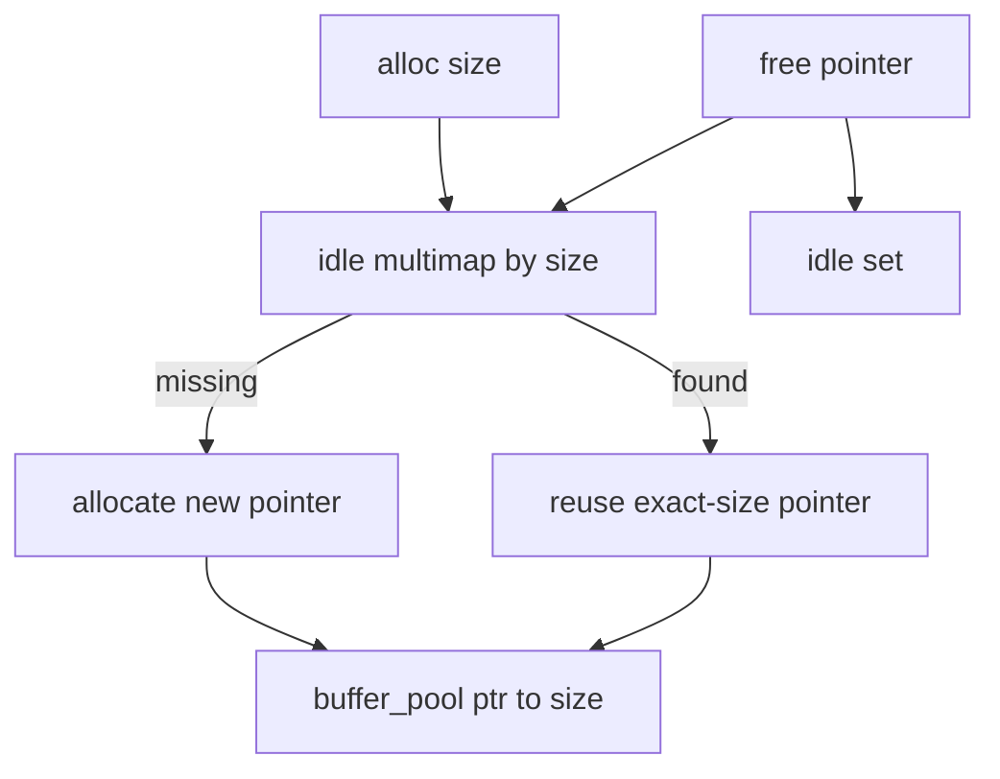

It tracks all allocated pointers in `buffer_pool`. Freeing a pointer does not immediately call `rtFree` or
`rtFreeHost`; it marks the pointer idle in `buffer_set_ldle` and `buffer_map_ldle` so a later exact-size allocation can
reuse it.

### `ggml_rpp_pool_leg`

The legacy pool keeps up to `MAX_BUFFERS` cached buffers. On allocation it chooses the smallest cached block that fits
the requested size. If no block fits, it allocates a new buffer with 5 percent look-ahead and 256 byte rounding. If the
cache is full on free, it releases the pointer to the RPP runtime.

### `ggml_rpp_pool_mem`

The arena pool preallocates a fixed-size block, currently defaulting to `16 MiB`, and suballocates aligned ranges from
that block. It tracks:

- `free_blocks_`: offset to size map for free ranges.
- `allocated_blocks_`: pointer to actual allocated size map.

Freed blocks are inserted back and coalesced with adjacent free ranges. This pool is useful when many small temporary
allocations would otherwise fragment runtime memory.

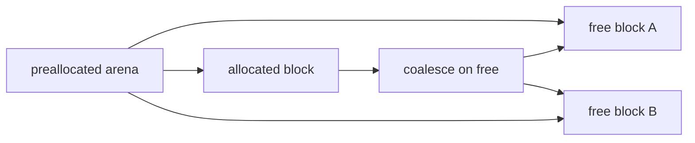

## Split tensor memory

Split buffers are used for row-split matrix weights. Unlike regular buffers, the split buffer base pointer is a dummy
address and the real per-device pointers are stored in `ggml_tensor_extra_gpu`.

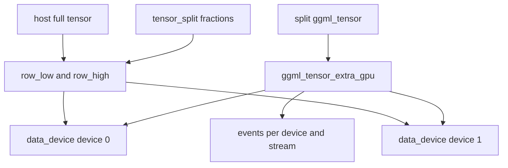

The split flow is:

1. `ggml_backend_rpp_split_buffer_type()` normalizes `tensor_split`. If none is provided, it uses the default split
   derived from device VRAM.
2. `init_tensor` computes each device's row range, allocates device memory for non-empty ranges, zeroes row padding,
   creates per-stream events, and stores pointers in `tensor->extra`.
3. `set_tensor` copies each row range from the full host tensor into that device's `data_device[id]`.
4. `get_tensor` copies each device range back into the corresponding host tensor slice.

Views of split tensors are not supported, and split buffers are currently restricted to contiguous tensors.

## Kernel workspace

Each `rpp_node_kernel` owns or shares an `rpp_kernel_context`. That context manages the low-level runtime resources used
by kernel graph builders.

```mermaid
flowchart TB
    kernelNode["rpp_node_kernel"]
    kernelCtx["rpp_kernel_context"]
    module["RPPmodule"]
    graph["RPPgraph"]
    exec["RPPgraphExec"]
    streams["kernel dma and mpu streams"]
    events["ping-pong events"]
    sram["24 MiB compute SRAM, 22 MiB working window"]
    workspace["dev_workspace and aux workspace"]
    devInOut["dev_in and dev_out"]

    kernelNode --> kernelCtx
    kernelCtx --> module
    kernelCtx --> graph
    kernelCtx --> exec
    kernelCtx --> streams
    kernelCtx --> events
    kernelCtx --> sram
    kernelCtx --> workspace
    kernelCtx --> devInOut
```

The hardware compute SRAM is `24 MiB` in total. The current backend allocates and checks a conservative `22 MiB`
virtual-SRAM working window with `rtMallocVirtSram`, creates kernel/DMA/MPU streams, creates synchronization events,
and creates an empty RPP graph. Kernel builders then carve temporary SRAM ranges from `virtual_sram_base`.

Longer-lived device workspaces use `dev_workspace` or `dev_aux_workspace`. Some ops allocate these from
`ggml_backend_rpp_context::pool()`, while some kernel builders lazily allocate specialized workspaces directly with
`rtMalloc`. Kernel context destruction releases virtual SRAM, streams, events, graph handles, and owned device buffers.

## SRAM lifecycle

SRAM is managed at `rpp_kernel_context` granularity. It is not allocated per tensor and is not part of
`ggml_rpp_pool`. Each kernel context receives one virtual SRAM region when the RPP node is constructed, and kernel
builders use offsets inside that region while building the RPP graph.

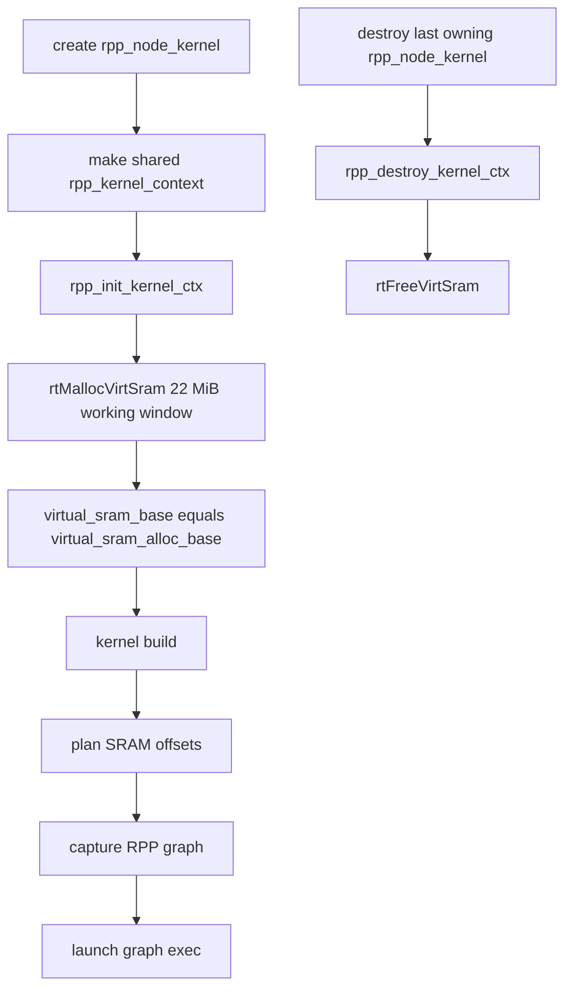

The total compute SRAM capacity and the backend budget should be read separately:

| Concept | Value | Meaning |
| --- | --- | --- |
| Hardware compute SRAM | `24 MiB` | Total SRAM physically available to computation. |
| Current backend working window | `22 MiB` | Amount currently requested with `rtMallocVirtSram` and used by kernel `SRAM_LIMIT` checks. |

The two SRAM fields have different roles:

| Field | Meaning |
| --- | --- |
| `virtual_sram_alloc_base` | Owning pointer returned by `rtMallocVirtSram`. This is the pointer released later. |
| `virtual_sram_base` | Working base address used by kernel builders to compute SRAM sub-regions. |

`rpp_init_kernel_ctx()` currently allocates `22 * 1024 * 1024` bytes out of the `24 MiB` total compute SRAM:

```text
rtMallocVirtSram(&virtual_sram_alloc_base, 22 MiB)
virtual_sram_base = virtual_sram_alloc_base
```

The remaining `2 MiB` is not part of the current kernel-planning budget. Treat it as reserved headroom unless the
runtime and every kernel builder are updated consistently to use a larger working window.

Kernel builders treat `virtual_sram_base` as a bump-planning base, but they do not call a shared SRAM allocator.
Instead, each builder computes a layout for its own graph:

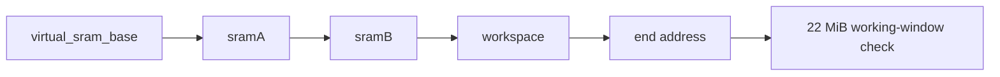

Typical examples:

- `rpp_rope` creates SRAM ranges for input, sine/cos tables, and output tiles.
- `rpp_rms_norm`, `rpp_norm`, and `rpp_l2_norm` reserve SRAM for IO, reduction workspace, lookup tables, and padded
  output staging.
- `rpp_mul`, `rpp_reduce_sum`, `rpp_pool_2d`, and matmul kernels compute tile workspaces from `virtual_sram_base`.
- Some kernels explicitly compare the planned end address against the current `22 MiB` working-window limit and report
  an overflow when the layout does not fit.

SRAM lifetime follows `rpp_kernel_context`, not graph launch:

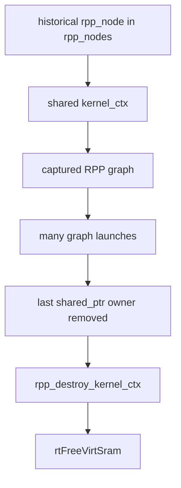

This means:

- Replaying a captured graph reuses the same virtual SRAM region.
- Reusing an existing `rpp_node_kernel` also reuses its `kernel_ctx` and SRAM.
- A derived `rpp_node_kernel` created from a base node can share the base `kernel_ctx` through `std::shared_ptr`, so the
  SRAM is released only when the last sharing node is destroyed.
- `rpp_node_kernel::~rpp_node_kernel()` calls `rpp_destroy_kernel_ctx()` only when `kernel_ctx.use_count() == 1`, which
  avoids double-freeing graph, stream, event, and SRAM handles.

Release order in `rpp_destroy_kernel_ctx()` is:

1. Destroy `RPPgraphExec`.
2. Destroy `RPPgraph`.
3. Destroy events.
4. Destroy DMA, kernel, and MPU streams.
5. Free `dev_aux_workspace` and `dev_owned` buffers.
6. Free virtual SRAM with `rtFreeVirtSram`.
7. Clear `dev_in` and `dev_out`.

When changing SRAM usage, keep these rules:

- Do not store tensor data in virtual SRAM across launches; it is a per-kernel scratch region captured by graph nodes.
- Do not free `virtual_sram_base` directly unless it is also the owning allocation. Use `virtual_sram_alloc_base` when it
  is set.
- Check the planned SRAM layout against the current `22 MiB` working budget before adding graph nodes. The hardware
  total is `24 MiB`, but increasing the budget requires coordinated changes to `rtMallocVirtSram` size and all
  `SRAM_LIMIT` checks.
- Keep SRAM offsets stable for captured graph reuse; if a shape change changes the SRAM layout, the node properties
  should force a rebuild or select a different reusable node.

## Lifetime and reset

The memory lifetime model is:

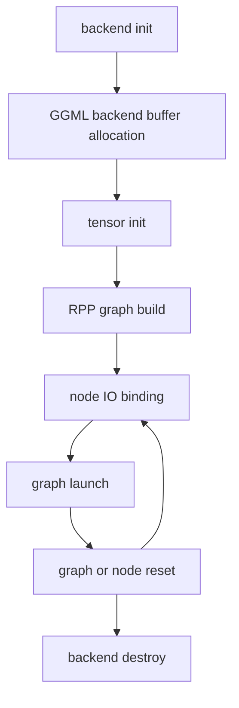

Persistent memory:

- Model tensors in RPP backend buffers.
- Split tensor per-device allocations in `tensor->extra`.
- Cached RPP node kernel contexts and captured graph execs.
- Backend memory pools and idle pool blocks.

Per-launch or temporary memory:

- Non-contiguous packed input buffers.
- Op-specific staging buffers recorded in node bindings.
- Pinned host conversion buffers used during `set_tensor`.

Reset behavior:

- `ggml_rpp_reset_graph()` clears current graph state but preserves historical nodes and captured graph caches.
- `ggml_rpp_reset_node()` clears node IO bindings and frees pool-backed temporary buffers.
- `update_ggml_rpp_infer_states()` clears `cur_rpp_nodes` and `rpp_io_buffers` when the first graph node changes shape
  or address, which handles prefill/decode style transitions.
- `ggml_backend_rpp_context` destruction releases streams, events, pools, graph wrappers, and cached resources.

## Debugging checklist

When debugging RPP memory issues:

1. Confirm whether the tensor uses a regular RPP buffer, host buffer, or split buffer.
2. Treat `tensor->data` as a device pointer for regular RPP buffers.
3. For split tensors, inspect `tensor->extra` and `ggml_tensor_extra_gpu::data_device`.
4. Check whether a matmul weight was converted during `set_tensor`, and whether `GGML_RPP_WEIGHTS_CACHE_FILE` returned
   a converted payload.
5. For wrong results with non-contiguous inputs, inspect `binding_i_buffers` and whether
   `ggml_rpp_pack_tensor_to_contiguous()` ran before launch.
6. For leaks or stale pointers, inspect `pool_buffers`, `rpp_io_buffers`, `ggml_rpp_reset_node()`, and graph reset
   paths.
7. For kernel failures, inspect `rpp_kernel_context::virtual_sram_base`, `dev_workspace`, `dev_in`, and `dev_out`.
