# RPP operator execution

This document describes the detailed design of the GGML operators lowered by the RPP backend. It focuses on the actual
`rpp_kernel_xxx.cpp` implementation rather than only listing supported operators.

For graph-level node mapping and reuse, see [RPP operator mapping](rpp_operator_mapping.md). For graph capture and
replay, see [RPP graph execution](rpp_graph_execution.md). For tensor memory, weight conversion, pools, and SRAM, see
[RPP memory management](rpp_memory_management.md). For supported quantized weight types and converted layouts, see
[RPP quantization support](rpp_quantization_support.md).

- [Common operator lifecycle](#common-operator-lifecycle)
- [Dispatch overview](#dispatch-overview)
- [Elementwise operators](#elementwise-operators)
- [Layout and copy operators](#layout-and-copy-operators)
- [Normalization operators](#normalization-operators)
- [Activation operators](#activation-operators)
- [Embedding and KV-cache operators](#embedding-and-kv-cache-operators)
- [ROPE](#rope)
- [Flash attention](#flash-attention)
- [Matrix operators](#matrix-operators)
- [Vision operators](#vision-operators)
- [Fusion operators](#fusion-operators)
- [Staging operators](#staging-operators)
- [Adding a new operator](#adding-a-new-operator)

## Common operator lifecycle

Most operator implementations use the same backend-side lifecycle:

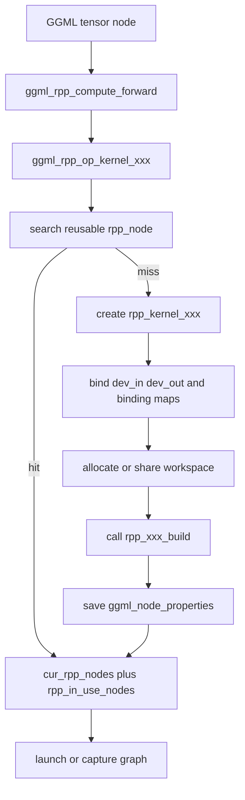

The common responsibilities are:

- validate supported dtype, rank, shape, stride, and layout constraints
- derive kernel dimensions from `ggml_tensor::ne`, `ggml_tensor::nb`, and op params
- bind device pointers into `rpp_kernel_context::dev_in` and `dev_out`
- save logical tensor bindings in `binding_i_buffers`, `binding_o_buffers`, and `binding_io_buffers`
- store `binding_io_tensors` so runtime IO updates can find the related GGML tensors
- allocate or share `dev_workspace` when the kernel requires DDR workspace
- snapshot `ggml_node_properties` for later reuse checks
- append the selected node to `cur_rpp_nodes` and `rpp_in_use_nodes`

The common reuse check is ubatch-aware. When `n_ubatch == 1`, implementations usually compare full `ne[]` and `nb[]`.
When `n_ubatch > 1`, they often skip full shape comparison but reject reuse if the active sequence dimension collapses
to decode (`ne[seq_len_index] == 1`). Operators with dynamic runtime updates, such as `GET_ROWS`, `SET_ROWS`, and
`CONT`, have more specialized reuse rules.

## Dispatch overview

`ggml_rpp_compute_forward()` is the authoritative single-op dispatch switch.

| GGML op or pattern | Implementation file | Main RPP entry |
| --- | --- | --- |
| `GGML_OP_ADD` | `rpp_add/src/rpp_kernel_add.cpp` | `ggml_rpp_op_kernel_add` |
| `GGML_OP_MUL` | `rpp_mul/src/rpp_kernel_mul.cpp` | `ggml_rpp_op_kernel_mul` |
| `GGML_OP_DIV` | `rpp_div/src/rpp_kernel_div.cpp` | `ggml_rpp_op_kernel_div` |
| `GGML_OP_CPY` | `rpp_cpy/src/rpp_kernel_cpy.cpp` | `ggml_rpp_op_kernel_cpy` |
| `GGML_OP_CONT` | `rpp_cont/src/rpp_kernel_cont.cpp` | `ggml_rpp_op_kernel_cont` |
| `GGML_OP_SCALE` | `rpp_scale/src/rpp_kernel_scale.cpp` | `ggml_rpp_op_kernel_scale` |
| `GGML_OP_GET_ROWS` | `rpp_get_rows/src/rpp_kernel_get_rows.cpp` | `ggml_rpp_op_kernel_get_rows` |
| `GGML_OP_SET_ROWS` | `rpp_set_rows/src/rpp_kernel_set_rows.cpp` | `ggml_rpp_op_kernel_set_rows` |
| `GGML_OP_UNARY` GELU variants | `rpp_unary/src/rpp_kernel_unary.cpp` | `ggml_rpp_op_kernel_unary` |
| `GGML_OP_GLU` | `rpp_glu/src/rpp_kernel_glu.cpp` | `ggml_rpp_op_kernel_glu` |
| `GGML_OP_NORM` | `rpp_norm/src/rpp_kernel_norm.cpp` | `ggml_rpp_op_kernel_norm` |
| `GGML_OP_L2_NORM` | `rpp_l2_norm/src/rpp_kernel_l2_norm.cpp` | `ggml_rpp_op_kernel_l2_norm` |
| `GGML_OP_RMS_NORM` | `rpp_rms_norm/src/rpp_kernel_rms_norm.cpp` | `ggml_rpp_op_kernel_rms_norm` |
| `GGML_OP_MUL_MAT` | `rpp_mul_mat/src/rpp_kernel_mul_mat.cpp` | `ggml_rpp_op_kernel_mul_mat` |
| `GGML_OP_MUL_MAT_ID` | `rpp_mul_mat_id/src/rpp_kernel_mul_mat_id.cpp` | `ggml_rpp_op_kernel_mul_mat_id` |
| `GGML_OP_ROPE` | `rpp_rope/src/rpp_kernel_rope.cpp` | `ggml_rpp_op_kernel_rope` |
| `GGML_OP_FLASH_ATTN_EXT` | `rpp_flash_attn_ext/src/rpp_kernel_flash_attn_ext.cpp` | `ggml_rpp_op_kernel_flash_attn_ext` |
| `GGML_OP_POOL_2D` | `rpp_pool_2d/src/rpp_kernel_pool_2d.cpp` | `ggml_rpp_op_kernel_pool_2d` |
| chained `ADD` | `rpp_reduce_sum/src/rpp_kernel_reduce_sum.cpp` | `ggml_rpp_op_kernel_reduce_sum` |
| `RMS_NORM -> MUL` | `rpp_rms_norm/src/rpp_kernel_rms_norm_fusion.cpp` | `ggml_rpp_op_kernel_rms_norm_mul_fusion` |
| expert routing pattern | `rpp_expert_routing/src/rpp_kernel_expert_routing_fusion.cpp` | `ggml_rpp_op_kernel_expert_routing_fusion` |
| expert forward pattern | `rpp_expert_forward/src/rpp_kernel_expert_forward.cpp` | `ggml_rpp_op_kernel_export_forward` |

## Elementwise operators

### ADD

`GGML_OP_ADD` is implemented by `rpp_add/src/rpp_kernel_add.cpp`.

Conceptually, ADD performs elementwise addition with optional broadcasting. For every output element, it reads the
matching values from `src0` and `src1`, applies broadcast mapping when one input has a smaller compatible shape, and
writes `dst = src0 + src1`.

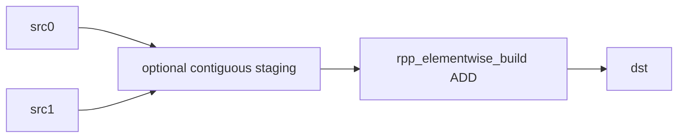

Design details:

- `ggml_rpp_create_kernel_add()` derives CHW dimensions from `dst->src[0]`.
- `W = ne[0]`, `H = ne[1]`, `C = ne[2]`; ubatch substitutes either `H` or `C` depending on `seq_len_index`.
- The implementation uses the shared elementwise builder from `rpp_mul/src/rpp_kernel_build.h` with
  `RPP_ELEMWISE_ADD`.
- ADD supports non-contiguous inputs. Non-contiguous source tensors get temporary device buffers from `ctx.pool()`.
- Before launch, `ggml_rpp_set_io_datas_device()` packs non-contiguous sources into those staging buffers with
  `ggml_rpp_pack_tensor_to_contiguous()`.
- Broadcast handling uses `rpp_broadcast_axis()`. Unsupported broadcast returns `-2` and fails the build path.
- There is no DDR workspace allocation for ADD.
- The add-chain fusion path may replace a sequence of compatible ADD nodes with `REDUCE_SUM`.

### MUL

`GGML_OP_MUL` is implemented by `rpp_mul/src/rpp_kernel_mul.cpp`.

Conceptually, MUL performs elementwise multiplication with optional broadcasting. It uses the same indexing model as ADD
but writes `dst = src0 * src1`. In model graphs it often applies learned scale tensors, gates, or residual weights.

Design details:

- Both sources must be contiguous. Unlike ADD, MUL does not stage non-contiguous inputs.
- Dimension derivation depends on `seq_len_index`.
- When `seq_len_index == 2`, ubatch substitutes `C`; `H` and `W` are taken from `dst`.
- When `seq_len_index == 1`, ubatch substitutes `H`; `C` and `W` are taken from `dst`.
- The kernel uses `rpp_elementwise_build(..., RPP_ELEMWISE_MUL, ...)`.
- Broadcast handling is shared with ADD and DIV through `rpp_broadcast_axis()`.
- It binds `src[0]->data`, `src[1]->data`, and `dst->data` directly.
- There is no separate workspace and no launch-time IO update.

### DIV

`GGML_OP_DIV` is implemented by `rpp_div/src/rpp_kernel_div.cpp`.

Conceptually, DIV performs elementwise division: `dst = src0 / src1`. The RPP implementation treats division as a
special elementwise path because the divisor side uses reciprocal helper data, so workspace sharing affects both build
cost and runtime behavior.

Design details:

- DIV follows the same contiguous-input and CHW dimension rules as MUL.
- The elementwise builder uses `RPP_ELEMWISE_DIV`.
- DIV has a shared reciprocal lookup workspace. The first DIV node allocates a `65536 * sizeof(uint16_t)` table through
  `ctx.pool()`.
- Later DIV nodes search all cached RPP graphs through `ggml_rpp_find_div_node()` and reuse the first DIV node's
  `dev_workspace`.
- Inputs and output are bound directly; no staging or pre-launch pack is used.
- This sharing avoids rebuilding and reallocating the BF16 reciprocal table for every layer.

### SCALE

`GGML_OP_SCALE` is implemented by `rpp_scale/src/rpp_kernel_scale.cpp`.

Conceptually, SCALE applies a scalar affine transform from GGML op params, roughly `dst = src0 * s + b`. It is used for
cheap whole-tensor rescaling where launching a general binary elementwise op would be unnecessary.

Design details:

- `dst` and `src[0]` must be contiguous and have the same shape.
- The scale parameters `s` and `b` are read from the first two floats in `dst->op_params`; `p` is read but not used by
  the current kernel.
- `cols = ne[0]`; `rows` is the product of higher dimensions, with ubatch substitution at `seq_len_index`.
- The implementation calls `rpp_scale_build()` and treats the tensor as a linear `rows * cols` buffer.
- Reuse must compare `op_params`, because a changed scale value changes kernel behavior even when tensor shapes are
  unchanged.

### REDUCE_SUM

`REDUCE_SUM` is not a normal GGML op dispatch in this backend. It is created by the ADD-chain fusion path and implemented
by `rpp_reduce_sum/src/rpp_kernel_reduce_sum.cpp`.

Conceptually, REDUCE_SUM sums a group of related tensor slices along one axis. The RPP fused path recognizes an ADD chain
over views that share the same `view_src`, then replaces multiple binary additions with one reduction kernel over that
shared source.

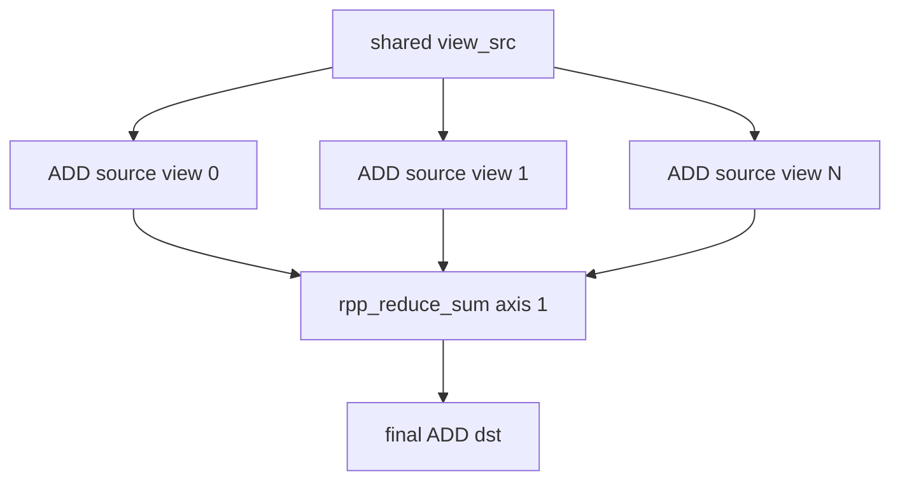

Design details:

- The fusion expects at least two sources and each source must be a `GGML_OP_VIEW`.
- All views must share the same `view_src`.
- The kernel binds the single `view_src->data` buffer, not each individual view buffer, as `dev_in[0]`.
- Each view is still recorded in `binding_i_buffers` and `binding_io_tensors` for graph bookkeeping.
- The reduction axis is hard-coded to `1`, effectively reducing `C x H x W` to `C x 1 x W`.
- `seq_len_index` is expected to be `1`, and the sequence length must match `view_src->ne[2]`.
- Invalid view patterns log errors and return `false` from creation.

## Layout and copy operators

### CPY

`GGML_OP_CPY` is implemented by `rpp_cpy/src/rpp_kernel_cpy.cpp`.

Conceptually, CPY copies data from one tensor layout or dtype to another. If source and destination are compatible, this
can be a device copy; when dtype conversion is needed, the operator converts elements while copying.

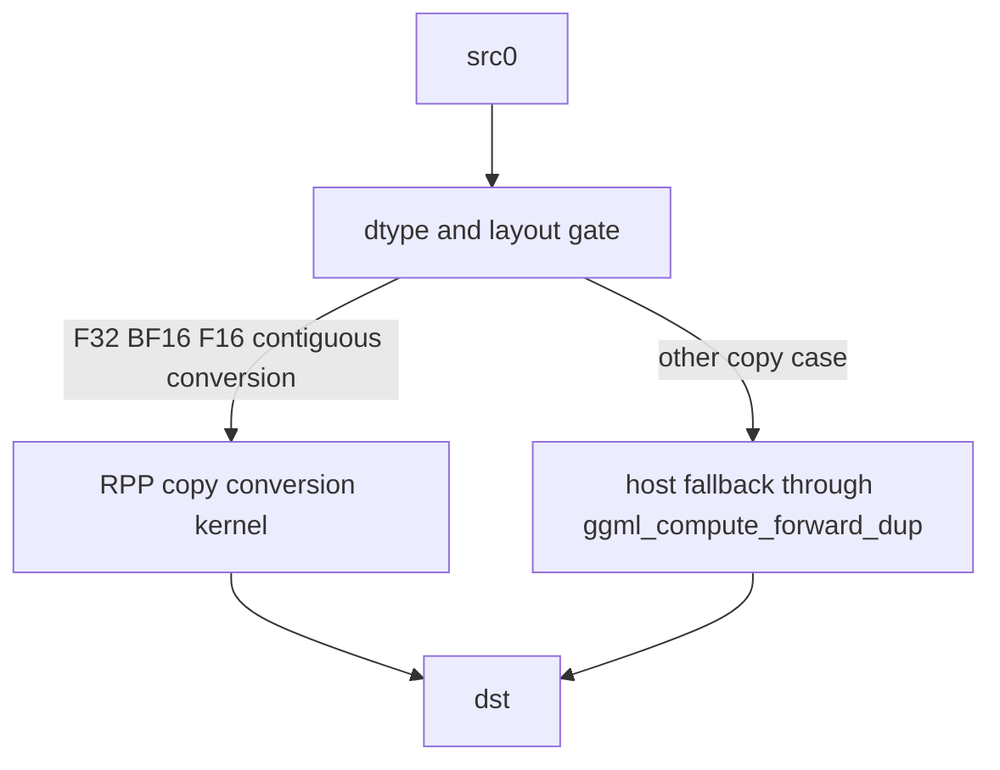

Design details:

- The kernel path is used for contiguous float-family conversions where input and output element sizes are 2 or 4 bytes
  and the dtype actually changes.
- Otherwise `use_cpu_fallback` is set.
- Same-dtype fallback uses device-to-device `rtMemcpy`.
- Different-dtype fallback copies through host pool buffers, temporarily points GGML tensors at host memory, calls
  `ggml_compute_forward_dup()`, then uploads the result back to device memory.
- In BF16 mode, view offsets are adjusted by `view_offs / 2` for physical device pointers while logical bindings keep
  the original tensor data pointer.
- `rpp_copy_build()` supports the current float conversion kernel path.
- CPY reuse always compares full shape and stride. Its ubatch shortcut is intentionally not used.
- When creating a child-exec graph without immediate instantiation, the implementation destroys and reinstantiates the
  existing `graphexec` with `RPP_GRAPH_INSTANTIATE_FLAG_CHILD_EXEC`.

### CONT

`GGML_OP_CONT` is implemented by `rpp_cont/src/rpp_kernel_cont.cpp`.

Conceptually, CONT materializes a contiguous tensor from a view or strided source. It reads source elements using the
original strides and writes them into a dense destination layout that later kernels can consume directly.

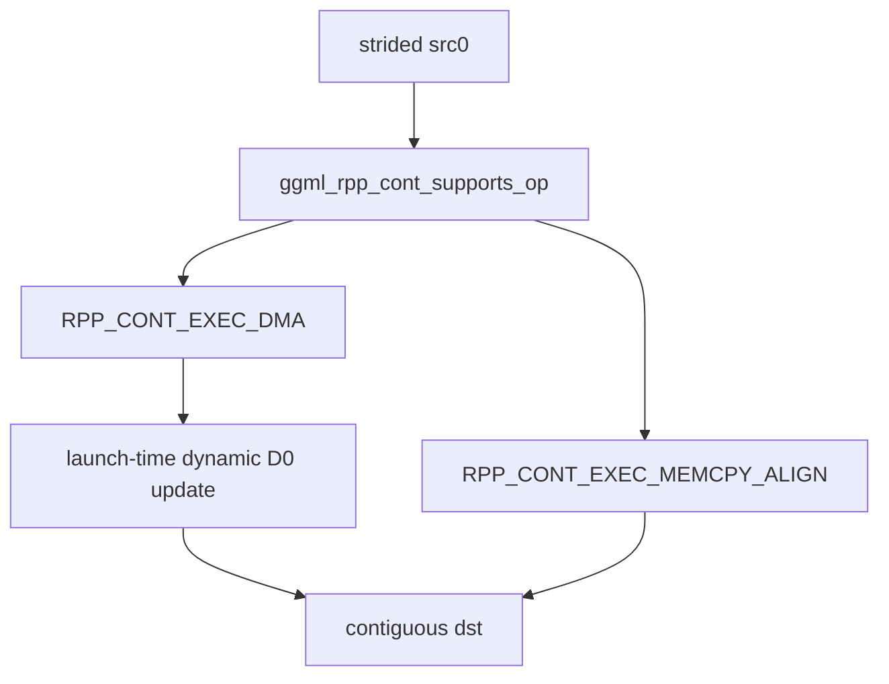

Design details:

- `CONT` materializes a contiguous output from a potentially strided source.
- `ggml_rpp_cont_supports_op()` checks matching shape and dtype plus stride constraints.
- DMA mode is selected when the source is compatible with the RPP DMA builder.
- MEMCPY_ALIGN mode is the fallback path. It collapses dimensions into a descriptor and checks bounds for dimensions,
  strides, and span.
- `seq_len_index` is derived from `dst->src[0]` rather than `dst`.
- In BF16 mode, F32 source view offsets are adjusted by `view_offs / 2`.
- DMA mode registers `ggml_rpp_set_io_datas_device()` as a launch function. This calls `rpp_update_dyn_d0(seq_len)` so
  the captured graph can reuse the same kernel while the dynamic outer dimension changes.
- Reuse is mode-specific. MEMCPY_ALIGN requires both destination and source layout descriptors to match.

## Normalization operators

### RMS_NORM

`GGML_OP_RMS_NORM` is implemented by `rpp_rms_norm/src/rpp_kernel_rms_norm.cpp`.

Conceptually, RMS_NORM normalizes each row by its root mean square. For a row `x`, it computes
`rms = sqrt(mean(x^2) + eps)` and writes `x / rms`; model graphs usually multiply the result by a learned scale tensor.

Design details:

- `src[0]` must be contiguous.
- Epsilon defaults to `1e-6f`, then reads `dst->op_params[0]` when that parameter is non-zero.
- `cols = dst->ne[0]`.
- `rows` is the product of all higher dimensions, with ubatch substitution at `seq_len_index`.
- The kernel binds one input and one output, then calls `rpp_rmsnorm_build(..., mode = 0, ...)`.
- Each RMS norm node needs a 128 KiB workspace.
- `ggml_rpp_find_rms_norm_node()` scans all cached graphs for the first `GGML_OP_RMS_NORM` and shares that workspace
  with later RMS norm nodes.
- Reuse uses `ggml_rpp_rms_norm_properties_is_same()` and is keyed on the same GGML destination tensor.

### RMS_NORM plus MUL fusion

`RMS_NORM -> MUL` is implemented by `rpp_rms_norm/src/rpp_kernel_rms_norm_fusion.cpp`.

Conceptually, this fusion performs RMS_NORM and the following learned-scale MUL in one backend node. It avoids writing
the RMS_NORM output to DDR only to read it back immediately for the MUL.

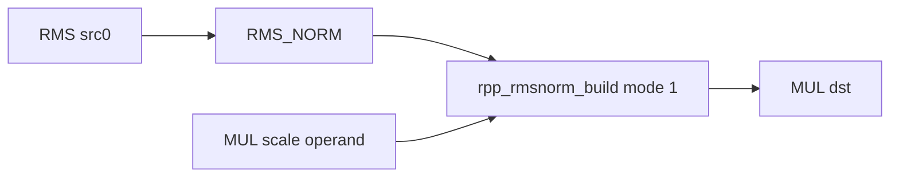

Design details:

- The anchor tensor is the RMS_NORM destination; `mul_tensor` is the downstream MUL node.
- The implementation finds the MUL operand that is not the RMS output and treats it as the scale tensor.
- The fused output is `mul_tensor->data`, not the intermediate RMS destination.
- If the scale tensor dtype differs from the RMS input dtype, the implementation converts it through a temporary pool
  buffer before binding.
- The build path calls `rpp_rmsnorm_build(..., mode = 1, ...)`.
- Workspace is shared with the first standalone RMS_NORM node, not with a separate fusion workspace pool.
- Reuse still uses RMS_NORM-style properties on the RMS destination, so the fusion is tied to the same graph anchor.

### NORM

`GGML_OP_NORM` is implemented by `rpp_norm/src/rpp_kernel_norm.cpp`.

Conceptually, NORM is a layer-norm-like row normalization. For each row, it computes mean and variance, then writes
`(x - mean) / sqrt(var + eps)` for the supported layout.

Design details:

- `src[0]` must be contiguous and have the same shape as `dst`.
- The first stride must be `sizeof(float)`, so this path is specialized for FP32 element stride.
- Epsilon is copied from op params and must be non-negative.
- Unlike RMS_NORM, `rows` is based on dimension 1 only, or `n_ubatch` when ubatch is active.
- `cols = src[0]->ne[0]`.
- The kernel allocates or shares a 128 KiB workspace through the first cached `GGML_OP_NORM` node.
- It calls `rpp_norm_build(rows, cols, eps, ...)`.

### L2_NORM

`GGML_OP_L2_NORM` is implemented by `rpp_l2_norm/src/rpp_kernel_l2_norm.cpp`.

Conceptually, L2_NORM normalizes each vector by its Euclidean length. It computes `sqrt(sum(x^2) + eps)` and divides
each element by that length.

Design details:

- `src[0]` must be contiguous.
- Epsilon is read from op params and must be non-negative.
- It uses the same row/column merge strategy as RMS_NORM: `cols = ne[0]`, `rows = product(ne[1..])`, with ubatch
  substitution at the active sequence dimension.
- Workspace is 128 KiB and is shared through `ggml_rpp_find_l2_norm_node()`.
- The build path calls `rpp_l2norm_build()`.

## Activation operators

### UNARY GELU

`GGML_OP_UNARY` is implemented by `rpp_unary/src/rpp_kernel_unary.cpp` for GELU variants.

Conceptually, the supported UNARY path applies GELU or GELU_ERF elementwise. GELU is a smooth nonlinear activation that
gates each value by a probability-like function of itself.

Design details:

- Only `GGML_UNARY_OP_GELU` and `GGML_UNARY_OP_GELU_ERF` are supported in RPP dispatch.
- Other unary operations return `false` from `ggml_rpp_compute_forward()`.
- `src[0]` and `dst` must be contiguous along dimension 0 through `ggml_is_contiguous_1()`.
- `dst->src[1]` must be null.
- Dimensions are treated as `W = ne[0]`, `H = ne[1]`, `C = ne[2]`, with ubatch substituting `H` or `C`.
- The implementation reuses the GEGLU_ERF builder in unary mode:
  `kernel_geglu_erf::rpp_gelu_build(..., mode = 0, split = 1, ...)`.
- There is no DDR workspace and no launch-time IO update.

### GLU

`GGML_OP_GLU` is implemented by `rpp_glu/src/rpp_kernel_glu.cpp`.

Conceptually, GLU is a gated activation block. It splits one packed input or reads two inputs, applies an activation such
as SiLU or GELU to one side, and multiplies that activated side by the other side; SwiGLU is common in transformer FFNs.

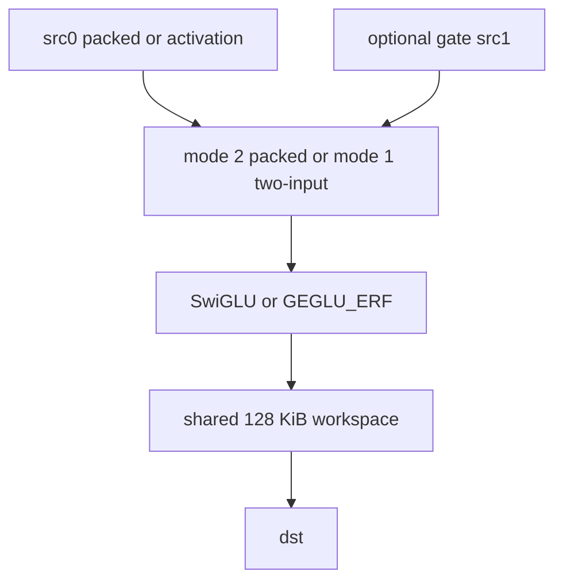

Design details:

- The supported variants are `GGML_GLU_OP_SWIGLU` and `GGML_GLU_OP_GEGLU_ERF`.
- In packed one-input mode, the input is split along the activation axis and the builder uses `mode = 2`.
- In two-input mode, `src[1]` must be contiguous along dimension 0 and have the same dtype as `src[0]`; the builder
  uses `mode = 1`.
- SwiGLU calls `kernel_swiglu::rpp_silu_build(..., split = 2, ...)`.
- GEGLU_ERF calls `kernel_geglu_erf::rpp_gelu_build(..., split = 1, ...)`.
- GLU allocates a 128 KiB workspace and shares it with the first cached GLU node.
- A SRAM-direct launch path exists for SwiGLU (`D2S -> kernel -> S2D`), but dispatch currently passes
  `use_sram_direct = 0`, so the normal DDR path is used.

## Embedding and KV-cache operators

### GET_ROWS

`GGML_OP_GET_ROWS` is implemented by `rpp_get_rows/src/rpp_kernel_get_rows.cpp`.

Conceptually, GET_ROWS is a gather operation. It reads row ids from `src[1]`, copies the selected rows from table tensor
`src[0]`, and writes the gathered rows into `dst`.

Design details:

- `dst`, `src[0]`, and `src[1]` must be contiguous.
- `src[0]` is the row table, `src[1]` contains row indices, and `dst` is the gathered output.
- BF16 mode adjusts source and destination view offsets by `view_offs / 2`.
- The build path calls `rpp_get_rows_build(cols, input_type_size, output_type_size, index_type_size, ...)`.
- The builder uses a swapped internal naming convention: the RPP build header treats the gathered output and rowdata
  differently from the logical GGML source/output naming, so the C++ wrapper is the source of truth for bindings.
- A launch function updates row-id metadata through `rpp_update_rowids(0, src[1]->ne[0])`.
- `rpp_update_rowids()` writes the runtime row range into device registers only when values change.
- Reuse intentionally does not compare full dimensions; sequence length is controlled by the row-id update.

### SET_ROWS

`GGML_OP_SET_ROWS` is implemented by `rpp_set_rows/src/rpp_kernel_set_rows.cpp`.

Conceptually, SET_ROWS is a scatter/update operation. It reads row ids from `src[1]`, then writes rows from `src[0]`
into selected rows of `dst`; this is used by KV-cache update paths.

Design details:

- `dst`, `src[0]`, and `src[1]` must be contiguous.
- `src[1]` must be `GGML_TYPE_I64`.
- `src[0]` contains values to write, `src[1]` contains row indices, and `dst` is the cache or destination tensor.
- `seq_len_index` is derived from `dst->src[0]` and is expected to be `1`.
- BF16 view handling matches GET_ROWS.
- The build path calls `rpp_set_rows_build(cols, input_type_size, output_type_size, ...)`.
- It registers the same row-id launch update as GET_ROWS.
- Reuse also relaxes full dimension checks because the active row span is updated dynamically.

## ROPE

`GGML_OP_ROPE` is implemented by `rpp_rope/src/rpp_kernel_rope.cpp`.

Conceptually, ROPE applies rotary position embedding. It treats pairs of hidden dimensions as 2-D vectors and rotates
them by sin/cos values derived from token position, injecting position information into attention activations.

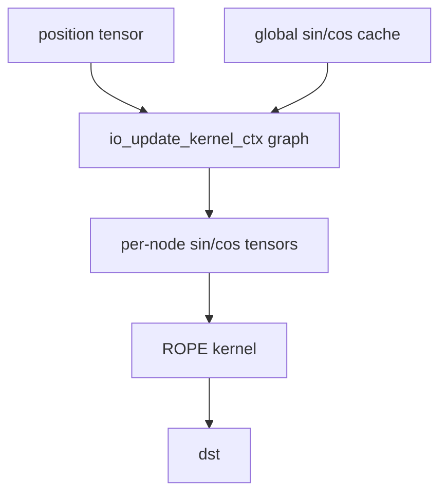

Design details:

- ROPE precomputes global sin/cos caches on device the first time it is needed. The cache size is based on
  `n_max_ctx * ne[0] * type_size`.
- CPU helper code computes the cache, including YaRN and M-RoPE parameters, then uploads it to device memory.
- Each ROPE node owns per-node `ggml_sin` and `ggml_cos` tensors sized for the current sequence or ubatch.
- `ggml_rpp_find_rope_node()` finds another ROPE node with matching dimensions. Later layers can share the original
  node's sin/cos tensors, host staging buffers, and `io_update_kernel_ctx`.
- Before the ROPE kernel launches, `ggml_rpp_update_io_datas_from_graph()` launches a small captured IO update graph.
  It reads the current start position, slices from the global sin/cos cache, and copies that slice into the per-node
  sin/cos buffers.
- This avoids rebuilding ROPE kernels when decode positions advance.
- ROPE supports non-contiguous activation input by passing `Tstride`, `Hstride`, and `Dstride` from `nb[]`; BF16 mode
  halves offsets where appropriate.
- Runtime dimensions are `T`, `H`, and `D`; `T` uses `ctx.n_ubatch` for prefill when ubatch is active.
- The build path calls `rpp_rope_build(T, H, D, strides, mode, n_rot, ...)`.

## Flash attention

`GGML_OP_FLASH_ATTN_EXT` is implemented by `rpp_flash_attn_ext/src/rpp_kernel_flash_attn_ext.cpp`.

Conceptually, FLASH_ATTN_EXT is fused scaled dot-product attention. It computes attention scores from Q and K, applies
scale, mask, and softmax, then multiplies the result by V:

```text
scores = softmax((Q * K^T) * scale + mask)
dst    = scores * V
```

The RPP implementation specializes this algorithm for prefill/decode shape, KV length, and shared graph parameters.

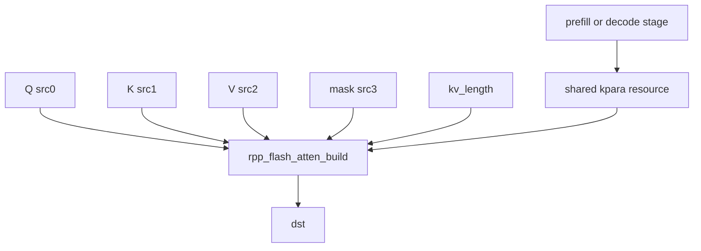

### Binding and dimensions

- `src[0]` is Q, `src[1]` is K, `src[2]` is V, and `src[3]` is the mask.
- All four sources are pushed into `dev_in`; `dst` is pushed into `dev_out`.
- Attention scale is copied from `dst->op_params[0]`.
- `Tq = ctx.n_ubatch` when ubatch is active and sequence length is greater than 1; otherwise `Tq = dst->ne[2]`.
- `Tk = rpp_node->kv_length`, not simply the live K tensor length.
- `Hq = Q.ne[2]`, `Hkv = K.ne[2]`, and `D = dst->ne[0]`.
- The builder receives separate byte widths for KV tensors, Q/output tensors, and mask tensors.

### KV-length stub ladder

Flash attention has a special prebuild mechanism for KV length.

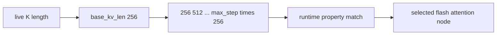

Design details:

- `base_kv_len` is `256`.
- `ctx.stub_kv_step` defaults to `8` and can be overridden with `GGML_RPP_STUB_KV_STEP`.
- `max_kv_step = min(n_max_ctx / 256, ctx.stub_kv_step)`.
- If the live K length is below the configured stub range, the implementation pre-creates a ladder of flash-attention
  nodes for `kv_length = 256, 512, ...`.
- At runtime, property checks select the node whose `kv_length` matches the effective cache length.
- If the live K length is already beyond the stub range, only one node is created with the live K length.

This is why the design must not treat `dst->src[1]->ne[1]` as the only build-time KV length. The RPP backend deliberately
builds future KV-length variants so later decode layers can reuse already instantiated kernels.

### Prefill/decode stage and kpara sharing

Flash attention also shares kernel parameter resources across layers.

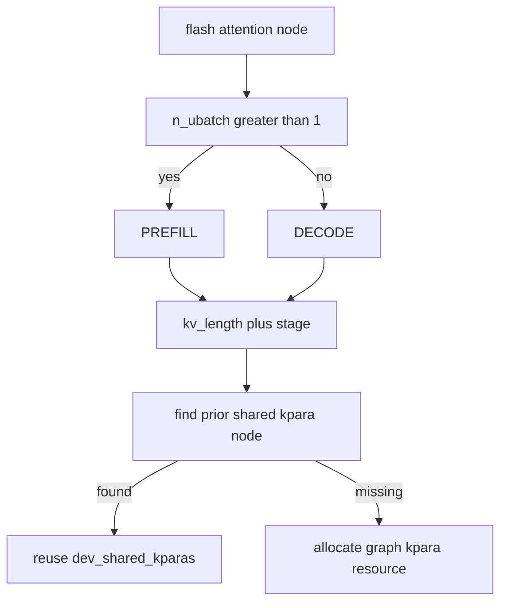

Design details:

- `n_ubatch > 1` maps to prefill; `n_ubatch == 1` maps to decode.
- When a node is instantiated as a child exec, `ggml_rpp_flash_attn_ext_instantiate_child_exec()` searches for a prior
  flash-attention node with the same `(kv_length, stage)`.
- If found, the new child exec uses the prior node's `dev_shared_kparas` and `shared_kpara_size` as an external kpara
  resource.
- If not found, it queries the required kpara size, allocates `RPP_GRAPH_RESOURCE_KPARA`, and stores ownership on the
  current node.
- This lets later attention layers reuse the same prebuilt kernel parameter resource for identical KV length and stage.

### Property and cache handling

- Flash attention uses a custom property snapshot function rather than the generic helper.
- For tensors named `cache_k` or `cache_v`, it patches stored `ne[1]` to `rpp_node->kv_length`.
- For tensors whose name contains `copy`, it patches stored `ne[0]` to `rpp_node->kv_length`.
- This property patching lets the reuse check follow the logical KV window represented by the selected stub node.
- The implementation records source addresses and op params, but does not store full stride data in the custom
  property function.

### Build variants

- Decode (`Tq == 1`) uses a VXM-style path.
- When decode `Tk <= 512`, it selects the smaller `rpp_flash_atten_build_vxm_v1` path.
- Larger decode windows use `rpp_flash_atten_build_vxm`.
- Prefill (`Tq > 1`) uses the normal batched flash-attention build path.
- Flash attention allocates a 256 KiB workspace and shares it with the first cached flash-attention node.

## Matrix operators

This section summarizes how matrix operators execute. For a dedicated support matrix, converted weight layouts, no-LUT
IQ paths, and cache behavior, see [RPP quantization support](rpp_quantization_support.md).

### MUL_MAT

`GGML_OP_MUL_MAT` is implemented by `rpp_mul_mat/src/rpp_kernel_mul_mat.cpp`.

Conceptually, MUL_MAT is a linear-layer matrix multiplication:

```text
dst[m, n] = sum_k activation[m, k] * weight[k, n]
```

Quantized weights are not consumed in their original GGML block layout; they are uploaded as converted RPP layouts.

Design details:

- `src[0]` is the weight tensor and must be detected by `is_matmul_weight()`.
- `src[0]` and `src[1]` must be contiguous and rank less than 3.
- `M = n_ubatch` for prefill ubatch, otherwise `src[1]->ne[1]`.
- `K = src[0]->ne[0]`; `N = src[0]->ne[1]`.
- Dispatch selects builders by weight type. Supported families include BF16/F32/F16 dense paths and Q2, Q3, Q4, Q5,
  Q6, and Q8 quantized paths.
- Quantized paths split the converted weight buffer into weights, scales, zeros, and optional lookup sections depending
  on the format.
- `M == 1` selects VXM decode builders for quantized formats where implemented.
- IQ formats currently use no-LUT variants in dispatch; LUT variants exist in the source tree but are not selected by
  the current switch.
- Matmul workspace is shared across earlier cached matmul nodes with the same weight type.
- `MUL_MAT` is not an exclusive graph op; it can be grouped into the shared parent `rpp_kernel_cgraph`.

### MUL_MAT_ID

`GGML_OP_MUL_MAT_ID` is implemented by `rpp_mul_mat_id/src/rpp_kernel_mul_mat_id.cpp`.

Conceptually, MUL_MAT_ID is expert-indexed matrix multiplication. It selects one or more expert weight matrices by id and
runs matmul for each selected expert:

```text
dst[token, expert_slot, n] =
    sum_k activation[token, k] * weight[expert_id[token, expert_slot], k, n]
```

This is the primitive behind MoE expert layers.

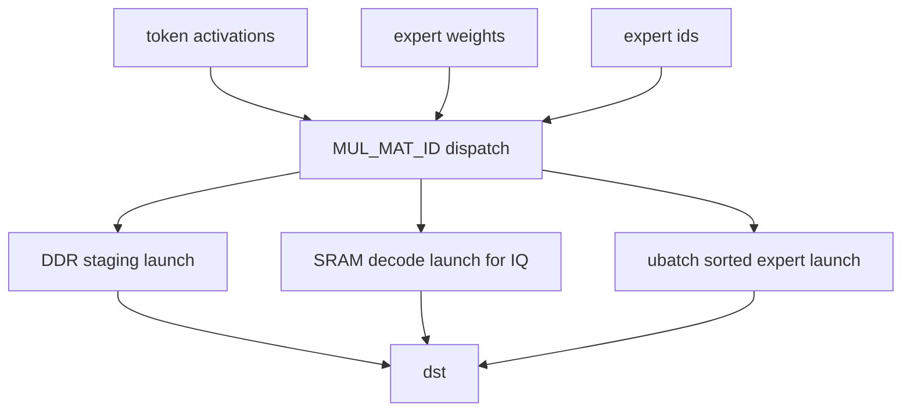

Design details:

- `MUL_MAT_ID` handles expert-indexed matrix multiplication.
- Expert weights are 3-D: `[K, N, n_experts]`.
- `M = n_ubatch` for prefill, otherwise `src[1]->ne[2]`.
- `n_expert = src[2]->ne[0]`.
- `src[1]`, `dst`, and `src[2]` are expected to be F32, F32, and I32 respectively.
- Dispatch supports F32 dense and quantized Q4_1, Q8_0, Q4_K, Q5_K, Q6_K, IQ3, IQ2_S, and IQ2_XS paths.
- `ggml_rpp_get_quantized_data()` calculates the per-expert byte slice for quantized weights.
- Some paths use pool staging buffers for activation, weight, and output data.
- IQ decode paths use SRAM-direct execution and store layout in `sram_io`.
- Launch has three modes:
  - decode IQ SRAM path: copy LUTs and activation into SRAM, select expert weight slice, launch, then scatter output
  - DDR path: copy data to staging buffers, launch per expert, then copy rows back
  - ubatch path: sort tokens by expert on host, gather activations, launch per expert batch, then unscatter output
- Cross-graph reuse can clone a compatible prior `MUL_MAT_ID` node when dimensions and weight type match.
- Workspace reuse is stricter for IQ formats because prefill and decode have different workspace needs.
- `MUL_MAT_ID` is marked as an exclusive graph op by `ggml_rpp_is_exclusive_graph_op()`, so graph execution gives it
  its own `rpp_kernel_cgraph` instead of grouping it into the shared parent graph.

## Vision operators

### POOL_2D

`GGML_OP_POOL_2D` is implemented by `rpp_pool_2d/src/rpp_kernel_pool_2d.cpp`.

Conceptually, POOL_2D downsamples spatial feature maps. The current RPP path implements the supported average-pooling
case: for each output pixel, read a `2 x 2` input window and write its average.

Design details:

- This implementation is specialized for a known vision path.
- It supports F32 input and output only.
- Both input and output must be contiguous.
- The supported pool is average pooling with kernel `2 x 2`, stride `2 x 2`, and zero padding.
- Shape is constrained to `32 x 32` spatial input and `16 x 16` spatial output, with total channels equal to `1152`.
- `GGML_RPP_DISABLE_POOL_2D` disables this path.
- `GGML_DUMP_CPU_POOL_2D` forces it unsupported for comparison/debugging.
- `rpp_pool_2d_build()` uses a HWC32 BF16 internal layout and requires channels to be a multiple of 32.
- Reuse compares `op_params` in addition to shape and address properties.
- `GGML_DUMP_RPP_POOL_2D` can dump the device output after synchronizing the stream.

## Fusion operators

Fusion runs inside `evaluate_and_capture_rpp_graph()` before normal single-op dispatch unless
`GGML_RPP_DISABLE_FUSION=1` is set.

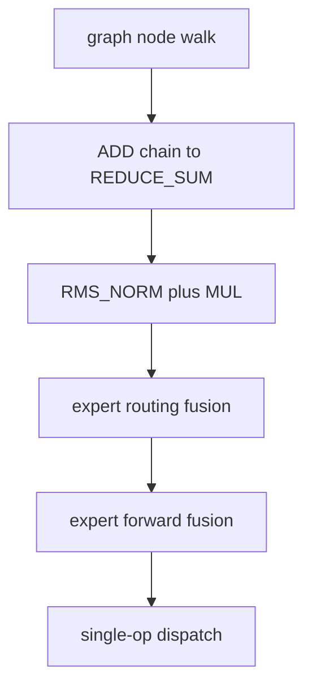

### Expert routing fusion

Expert routing fusion is implemented by `rpp_expert_routing/src/rpp_kernel_expert_routing_fusion.cpp`.

Conceptually, expert routing fusion performs router post-processing in one RPP path. It takes router logits, computes
top-k expert ids and normalized routing weights, and replaces the softmax/argsort/view/get_rows/sum_rows/clamp/div
routing chain.

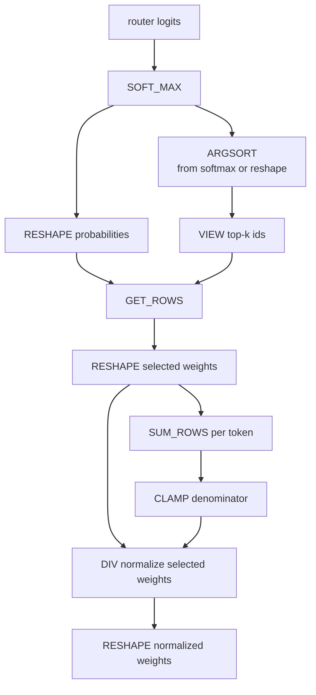

Design details:

- The matcher supports a compact pattern and a second pattern that includes `RESHAPE` and `CLAMP`; the latter matches
  the routing graph shape shown above.
- The anchor node is the `SOFT_MAX`.
- Validation requires F32 logits/weights, I32 ids, descending argsort, `scale == 1`, `max_bias == 0`, and no unsupported
  softmax extra sources.
- `n_experts` must be a power of two and no greater than 512.
- `n_expert_used` must be between 1 and `n_experts`.
- Skipped intermediate nodes must not be graph outputs.
- After a successful fusion, the graph walker records argsort/get_rows/sum_rows/div and optional clamp in
  `expert_judgment_runtime_skips`.
- The RPP node binds router logits as input and writes the argsort/id buffer plus the normalized-weight buffer, so later
  `VIEW`/`RESHAPE` consumers can continue to reference the original GGML tensors.
- `num_tokens` uses `ctx.n_ubatch` during prefill.
- Workspace is shared with the first prior expert-routing fusion node.

### Expert forward fusion

Expert forward fusion is implemented by `rpp_expert_forward/src/rpp_kernel_expert_forward.cpp`.

Conceptually, expert forward fusion combines the MoE FFN compute path: gate expert matmul, up expert matmul, SwiGLU,
down expert matmul, top-k weighting, and residual combine. Decode keeps intermediates in SRAM when the planned layout
fits the backend working window.

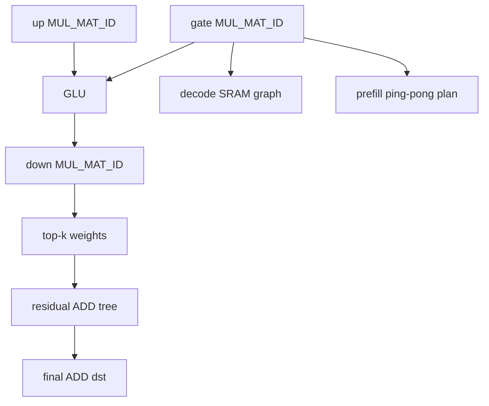

#### Build logic

The graph build path is entered through `ggml_rpp_create_kernel_dispatch_export_forward()`. The dispatcher records the
sequence-length axis from the gate `MUL_MAT_ID`, saves `ctx.n_ubatch` for prefill, then selects one of two builders:

- `seq_len == 1` uses `ggml_rpp_create_kernel_export_forward_vxm()` and builds a decode VXM graph.
- `seq_len > 1` uses `ggml_rpp_create_kernel_export_forward()` and builds a prefill expert-batched graph.

The prefill builder validates the five fused tensors (`gate`, `up`, `down`, `div`, and `add`), requires I32 expert ids
and contiguous expert weights, then derives `B`, `topk`, `K`, `N`, and `nr_of_experts` from the gate tensor. It allocates
one host/device route-metadata block containing sorted token ids, per-expert counts, expert offsets, and top-k slot ids.
It also prepares the quantized layouts for the gate/up/down expert weights and initializes shared DDR workspaces for the
quant LUTs and SiLU LUT. After binding the sparse activation, route metadata, weight descriptors, routing weights, and
final output, it calls `rpp_matmul_id_fusion_build()` twice: once for `plan` and once for `plan_next`. These two plans
share the same inputs and workspace but have separate graph executions, allowing runtime expert execution to ping-pong
between them.

The decode VXM builder targets the single-token path. It checks the fixed MoE FFN relationship
`gate/up -> SwiGLU -> down -> top-k combine`, allocates separate kernel contexts for gate, up, GLU, down, and top-k
combine, prepares a SRAM layout for activations, weights, intermediate outputs, routing weights, and the final ADD
output, then captures one graph. During capture it copies activations and LUT/workspace data to SRAM, updates the
selected expert weights with IO update graph nodes, launches gate and up VXM kernels, runs SwiGLU, launches down VXM,
runs the top-k combine kernel, and copies the final SRAM result back to the ADD destination.

#### Run logic

Runtime execution is handled by `ggml_rpp_run_kernel_export_forward()`. Decode is the simple path: when the gate sequence
length is one, the already-instantiated VXM graph is launched directly.

Prefill rebuilds only the route-dependent runtime data. It first copies the I32 expert ids to host and computes the
per-expert token grouping with `ggml_rpp_get_expert_forward_route_info()`. The generated metadata is copied back to
device memory and into the SRAM route buffers. Static inputs such as sparse activations, quant LUTs, the SiLU LUT, and
selected weight data are copied to SRAM before the expert loop starts. The runtime then launches the optional
`experts_input_exec` graph, iterates over active experts, preloads the current expert weights, and alternates
`plan.graphs.single_expert_exec` with `plan_next.graphs.single_expert_exec`. This ping-pong schedule overlaps the weight
preload path with single-expert compute. After all active experts run, `experts_output_exec` scatters/merges the expert
outputs and the final result is copied from SRAM to `add->data`.

The timeline below shows this runtime shape. The pink `DtoS` blocks are device-to-SRAM staging work before compute,
and the green `matrix_mul_vxm...` blocks are the expert compute launches. The visible gap between the initial copies and
the later matrix kernels corresponds to route preparation, SRAM staging, and per-expert weight preload before each graph
launch.

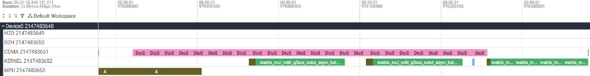

Design details:

- The matcher starts at a gate `MUL_MAT_ID` and checks a fixed MoE FFN pattern involving gate, up, GLU, down, weights,
  and residual combine nodes.
- Supported quantized expert weights are IQ2_S, IQ2_XS, and IQ3_XXS.
- `topk` is padded up to an internal maximum of 8.
- The fusion records properties for gate, up, down, div, and add tensors.
- Decode (`seq_len == 1`) builds a SRAM-centered VXM graph with sub-kernels for gate, up, GLU, down, and top-k combine.
- The decode path uses SRAM for intermediate gate/up/GLU/down data. It checks the working SRAM budget and skips fusion
  if the required layout exceeds the 22 MiB backend working window.
- Per-expert weight switching is implemented with an IO update graph and indirect memcpy nodes.
- Prefill (`seq_len > 1`) builds route metadata on host, copies token/expert metadata to device, runs a ping-pong
  `plan` and `plan_next` for single-expert execution, and then unscatters outputs.
- The prefill path limits token count per expert to `ctx.n_ubatch`.
- Cross-graph reuse can clone a compatible prefill fusion node and update plan inputs instead of rebuilding the whole
  expert-forward plan.
- Unlike expert routing, this fusion does not register a runtime skip set; the graph walker continues after selecting
  the gate fusion path.

### ADD chain fusion

The ADD-chain fusion is implemented by `rpp_reduce_sum/src/rpp_kernel_reduce_sum.cpp` and described in
[REDUCE_SUM](#reduce_sum).

Conceptually, this fusion is the graph-pattern form of REDUCE_SUM: it replaces several binary ADD launches with one
reduction over related view slices.

### RMS_NORM plus MUL fusion

The RMS norm fusion is implemented by `rpp_rms_norm/src/rpp_kernel_rms_norm_fusion.cpp` and described in
[RMS_NORM plus MUL fusion](#rms_norm-plus-mul-fusion).

Conceptually, this fusion is the graph-pattern form of RMS_NORM plus learned scale multiplication.

## Staging operators

### Fused CON2D

`rpp_con2d/src/rpp_kernel_con2d.cpp` contains a fused vision convolution prototype, but it is not a normal dispatched
operator in the current graph walker.

Conceptually, the fused CON2D prototype targets patch-embedding style convolution. It combines im2col, matmul, reshapes,
permutes, and contiguous copies into one convolution-like path.

Design details:

- The matcher targets a fixed patch-embedding chain:
  `IM2COL -> RESHAPE -> weight RESHAPE -> MUL_MAT -> RESHAPE -> PERMUTE -> CONT -> RESHAPE -> TRANSPOSE -> CONT`.
- It requires single-use intermediate nodes and no output views on the intermediates.
- The implementation derives convolution parameters from IM2COL op params and binds input, weight, and final output.
- `ctx.use_ubatch` is asserted false.
- The call to `rpp_fused_con2d_build()` is currently commented out.
- If `graphexec` is null, launch returns success without executing.
- Treat this directory as staging until the build path is enabled and the main graph walker calls the fusion.

## Adding a new operator

Use this checklist when adding a new RPP operator:

1. Add or reuse a module under `ggml/src/ggml-rpp/rpp_<op>/`.
2. Define the node class and operation entry in the module header.
3. Implement `ggml_rpp_op_kernel_<op>()` with find-or-create behavior.
4. Validate dtype, rank, shape, stride, and supported op params before building.
5. Bind physical device pointers into `dev_in` and `dev_out`.
6. Record logical GGML tensors in `binding_i_buffers`, `binding_o_buffers`, `binding_io_buffers`, and
   `binding_io_tensors`.
7. Allocate or share DDR workspace through `init_workspace()` if needed.
8. If the kernel needs launch-time metadata changes, register an `add_launch_func()` callback.
9. Save enough `ggml_node_properties` to detect pointer, shape, stride, source, and op-param changes.
10. Add the op to `ggml_rpp_compute_forward()` and, if needed, `ggml_backend_rpp_device_supports_op()`.
11. Decide whether it can be grouped into a shared captured graph or must be exclusive.
12. Add RPP unit tests and update this reference.
