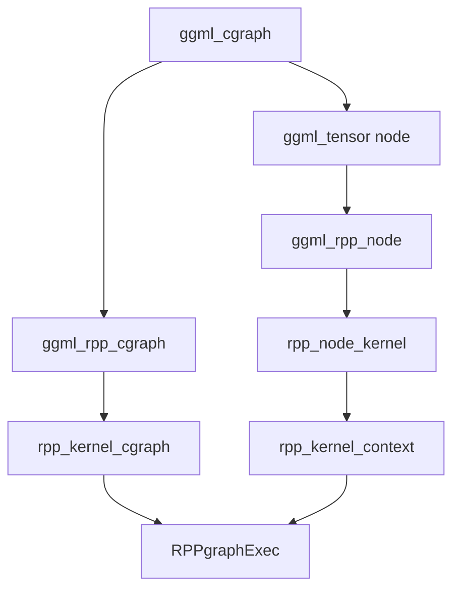
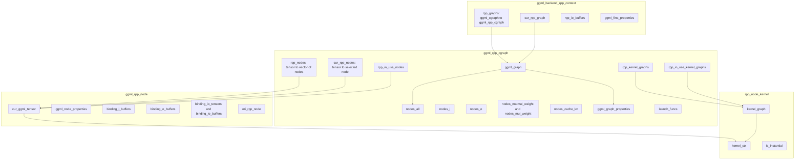
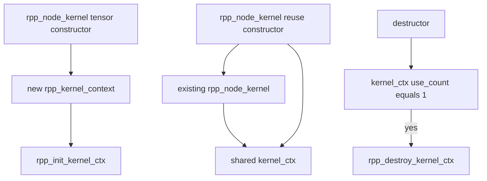
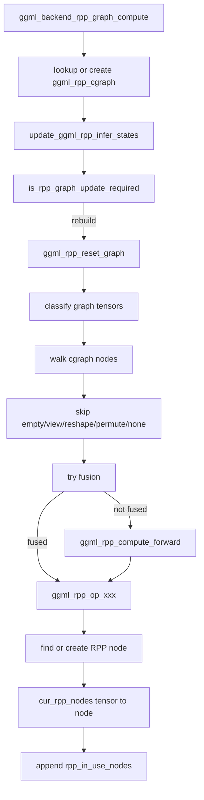
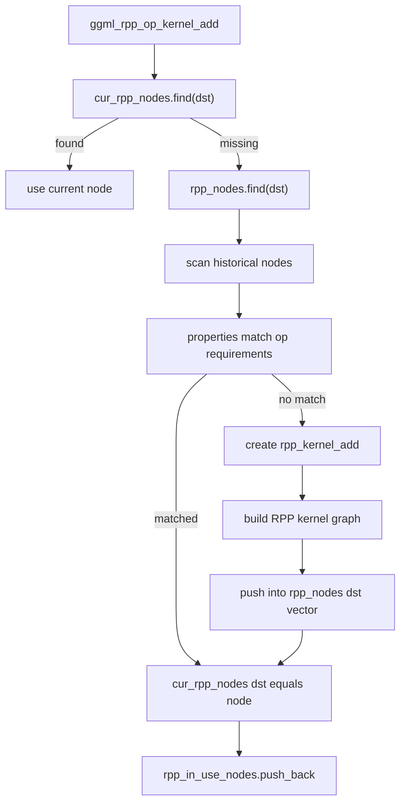
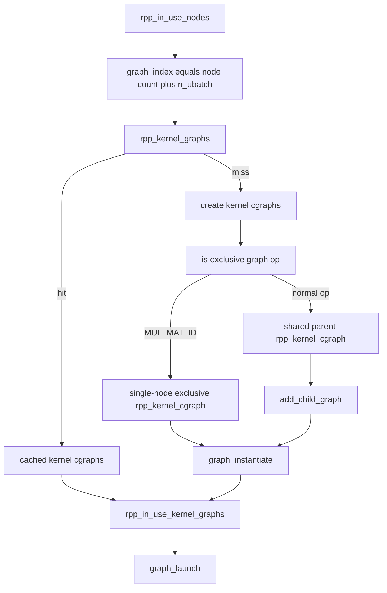
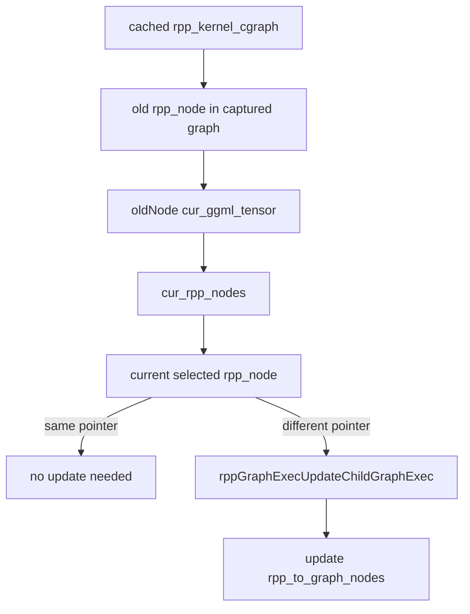
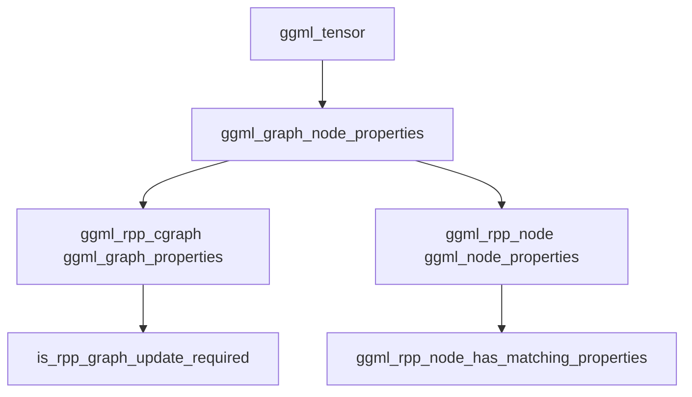
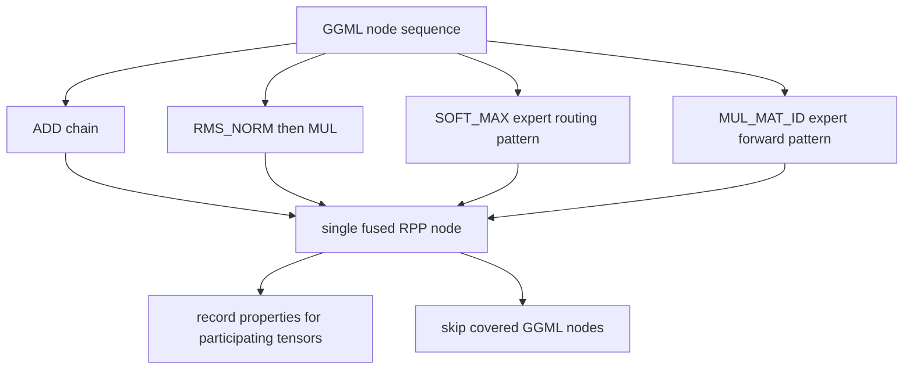
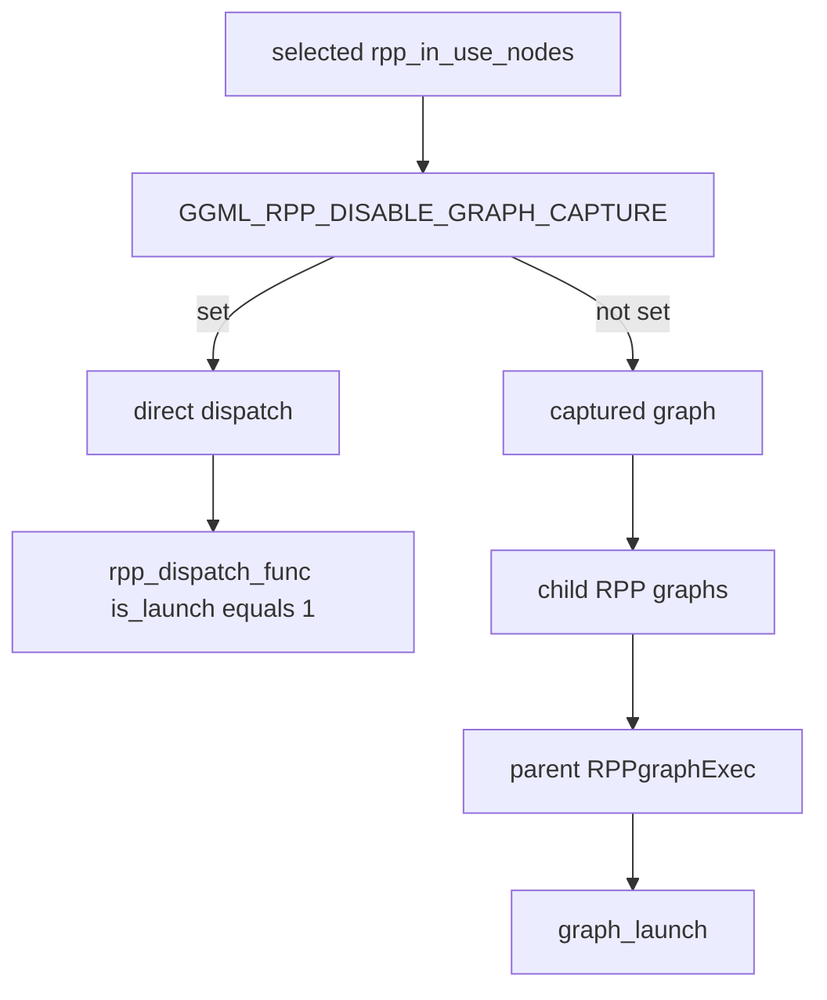

# RPP operator mapping

This document explains how GGML graph nodes are mapped to RPP backend nodes, how `rpp_common.h` structures relate to
each other, and how RPP nodes are reused across graph launches.

- [Core concepts](#core-concepts)
- [Data structure relationships](#data-structure-relationships)
- [Mapping flow](#mapping-flow)
- [Node reuse](#node-reuse)
- [Graph capture relationship](#graph-capture-relationship)
- [Property tracking](#property-tracking)
- [Fusion mapping](#fusion-mapping)
- [Direct dispatch vs captured graph](#direct-dispatch-vs-captured-graph)
- [Implementation checklist](#implementation-checklist)

## Core concepts

The RPP backend does not replace `ggml_cgraph`. Instead, it builds a backend-side mirror for each GGML graph:

- `ggml_cgraph` is the source graph produced by GGML.
- `ggml_tensor` nodes inside the cgraph are the scheduler-visible operations.
- `ggml_rpp_cgraph` is the RPP wrapper for one `ggml_cgraph`.
- `ggml_rpp_node` is the RPP-side representation of one lowered GGML operation or fused operation.
- `rpp_node_kernel` is the default executable RPP node type. It owns or shares an `rpp_kernel_context`.
- `rpp_kernel_cgraph` groups RPP kernel nodes into launchable RPP graph execs.

At a high level:

The most important distinction is between historical nodes and current nodes:

- `ggml_rpp_cgraph::rpp_nodes` stores all reusable RPP node candidates previously built for a `ggml_tensor`.
- `ggml_rpp_cgraph::cur_rpp_nodes` stores the RPP node selected for the current graph evaluation.
- `ggml_rpp_cgraph::rpp_in_use_nodes` stores the current launch order used by graph capture or direct dispatch.

## Data structure relationships

`rpp_common.h` defines the ownership and lookup model. The backend context owns graph wrappers, each graph wrapper owns
historical RPP nodes and captured kernel graphs, and each node points back to the GGML tensor it implements.

### `ggml_backend_rpp_context`

`ggml_backend_rpp_context` is the per-backend root object. For operator mapping, the key fields are:

| Field | Meaning |
| --- | --- |
| `rpp_graphs` | Cache from `ggml_cgraph *` to its `ggml_rpp_cgraph`. |
| `cur_rpp_graph` | The graph wrapper currently being evaluated. |
| `rpp_io_buffers` | Backend IO buffer cache used by node bindings. |
| `ggml_first_properties` | Tracks the first graph node to detect prefill/decode style transitions. |
| `n_ubatch`, `use_ubatch` | Affect node specialization and captured graph variants. |

### `ggml_rpp_cgraph`

`ggml_rpp_cgraph` is the central mapping object.

| Field | Meaning |
| --- | --- |
| `ggml_graph` | The original GGML graph. |
| `nodes_all` | All GGML nodes considered in this graph wrapper. |
| `nodes_i` | Runtime inputs whose sources are outside the cgraph. |
| `nodes_o` | Graph outputs that are not consumed by later cgraph nodes. |
| `nodes_matmul_weight` | External matmul weight tensors. |
| `nodes_mul_weight` | External elementwise multiply weight tensors. |
| `nodes_cache_kv` | KV-cache tensors used by row update/read paths. |
| `rpp_nodes` | Historical node pool: one GGML tensor can have multiple reusable RPP nodes. |
| `cur_rpp_nodes` | Current launch mapping: one GGML tensor maps to the selected RPP node for this evaluation. |
| `ggml_graph_properties` | Per-cgraph-node snapshots used to decide if graph rebuild is required. |
| `rpp_in_use_nodes` | Ordered RPP nodes participating in the current launch. |
| `rpp_kernel_graphs` | Captured RPP graph execs indexed by a graph variant key. |
| `rpp_in_use_kernel_graphs` | Captured graphs selected for the current launch. |
| `launch_funcs` | Deferred functions that run before captured graph launch. |

### `ggml_rpp_node`

`ggml_rpp_node` is the base class for all lowered operations.

| Field | Meaning |
| --- | --- |
| `cur_ggml_tensor` | The GGML tensor that this RPP node currently implements. |
| `ggml_node_properties` | Snapshots of the output tensor and source tensors that the node depends on. |
| `binding_i_buffers`, `binding_o_buffers` | Tensor-to-device-buffer bindings for inputs and outputs. |
| `binding_io_tensors`, `binding_io_buffers` | Ordered IO binding metadata used by per-op launch setup. |
| `pool_buffers`, `release_buffers` | Buffers allocated from backend pools and released/reset later. |
| `ori_rpp_node` | Original node when a new node shares an existing node's underlying resources. |
| `n_ubatch`, `seq_len_index` | Shape specialization fields used by prefill/decode and micro-batch paths. |
| `rpp_dispatch_func()` | Per-op virtual dispatch entry for build, update, or direct launch. |

### `rpp_node_kernel` and `rpp_kernel_context`

`rpp_node_kernel` is the default executable node. Its constructor creates a new `rpp_kernel_context`; the reuse
constructor can share an existing `kernel_ctx` through `std::shared_ptr`.

`rpp_kernel_context` holds the actual RPP runtime objects: module, graph, graph exec, graph node, events, streams,
virtual SRAM, and temporary device workspaces.

## Mapping flow

The mapping begins in `ggml_backend_rpp_graph_compute()` and `evaluate_and_capture_rpp_graph()`.

The mapping has two levels:

1. Cgraph-level mapping decides whether the backend wrapper needs rebuilding and classifies graph inputs, outputs,
   weights, and KV-cache nodes.
2. Op-level mapping selects or creates the concrete `ggml_rpp_node` for each executable GGML node.

`ggml_rpp_compute_forward()` is the central switch. It dispatches by `dst->op` to functions such as
`ggml_rpp_op_add()`, `ggml_rpp_op_mul_mat()`, `ggml_rpp_op_rms_norm()`, `ggml_rpp_op_rope()`, and
`ggml_rpp_op_flash_attn_ext()`.

## Node reuse

Each op implementation follows the same basic pattern. `rpp_add` is a representative example:

The important behavior:

- `cur_rpp_nodes` prevents duplicate work within one graph rebuild. If a tensor already has a current node, the op
  function uses it immediately.
- `rpp_nodes[dst]` is a history list. It allows the backend to reuse an older node whose shape, layout, sources, and
  op parameters still match.
- If no historical node matches, the op creates a new derived `rpp_node_kernel`, builds its RPP graph, records its
  properties, and stores it in `rpp_nodes[dst]`.
- Once selected, the node is written to `cur_rpp_nodes[dst]` and appended to `rpp_in_use_nodes`.

This is why one GGML tensor can have more than one RPP node over time. For example, prefill and decode can use the same
logical `ggml_tensor *` but require different `n_ubatch`, sequence length, KV length, or graph binding properties.

## Graph capture relationship

After all current RPP nodes are selected, `evaluate_and_capture_rpp_graph()` builds or reuses captured RPP graph execs.
The current implementation uses a graph variant key derived from:

- the number of RPP nodes in `rpp_in_use_nodes`
- the active node `n_ubatch`

There are two `rpp_kernel_cgraph` modes:

| Mode | Meaning |
| --- | --- |
| Shared graph | Owns a parent `RPPgraph` and adds each op graph as a child node. Most ops use this path. |
| Exclusive graph | Wraps one already-instantiated per-op graph. `MUL_MAT_ID` currently uses this path. |

On a graph-cache hit, `rpp_kernel_cgraph::update_child_graph()` compares old child nodes with the latest
`cur_rpp_nodes`. If a tensor selected a different RPP node this time, the captured graph updates the child graph exec
binding to point at the new node.

This makes graph capture reusable even when a later launch chooses a different specialized RPP node for the same GGML
tensor.

## Property tracking

Property snapshots are the basis of both graph-level rebuild checks and node-level reuse checks.

`ggml_graph_node_properties` stores:

- tensor data address
- GGML op type
- shape (`ne`)
- strides (`nb`)
- source tensor data addresses
- op parameters

`ggml_rpp_node_set_properties()` records the output tensor and all non-null source tensors for a node. A node can then
be reused only if the current tensors still match the stored properties. This protects the backend from reusing an RPP
kernel graph when the shape, layout, source buffers, or relevant op parameters changed.

There are a few intentional exceptions:

- `GGML_OP_CPY` and `GGML_OP_VIEW` do not require the same data address in the same way as normal compute ops.
- `GGML_OP_SCALE` additionally checks `op_params`, because scale values affect the generated operation.

## Fusion mapping

Fusion creates a single RPP node for a multi-node GGML pattern. The fused node is usually keyed by the first or primary
GGML tensor in the pattern, while the fused implementation records properties for all tensors it depends on.

Examples:

- Consecutive `ADD` nodes can be lowered to the reduce-sum path.
- `RMS_NORM` followed by `MUL` can be lowered through `ggml_rpp_op_rms_norm_fused()`.
- Expert routing and expert forward patterns create specialized fused nodes and skip covered runtime nodes.

For fused ops, node reuse is stricter because the RPP node may depend on multiple GGML tensors. The implementation
should call `ggml_rpp_node_set_properties()` for every tensor that affects the fused kernel.

## Direct dispatch vs captured graph

The same RPP node mapping is used by both execution modes.

When graph capture is disabled, each selected node is launched directly through `rpp_dispatch_func(ctx, tensor, 1, 1)`.
When graph capture is enabled, per-op dispatch is first used to build child graphs; then parent graph execs are launched.

## Implementation checklist

When adding or changing an RPP op mapping:

1. Add the public op entry in the corresponding `rpp_<op>/` module and dispatch it from `ggml_rpp_compute_forward()`.
2. Implement the op-specific `supports_op` dtype and shape gate in `ggml_backend_rpp_device_supports_op()`.
3. Follow the node selection pattern: check `cur_rpp_nodes`, search `rpp_nodes[dst]`, create a new node only when no
   reusable node matches.
4. Record all tensors that affect the generated kernel with `ggml_rpp_node_set_properties()`.
5. Bind the selected node into `cur_rpp_nodes[dst]` and append it to `rpp_in_use_nodes`.
6. If the op must not be grouped into a shared parent graph, add it to `ggml_rpp_is_exclusive_graph_op()`.
7. Add focused tests under `tests/tests_rpp/`, including a case that forces node reuse or graph update when shapes or
   source buffers change.
