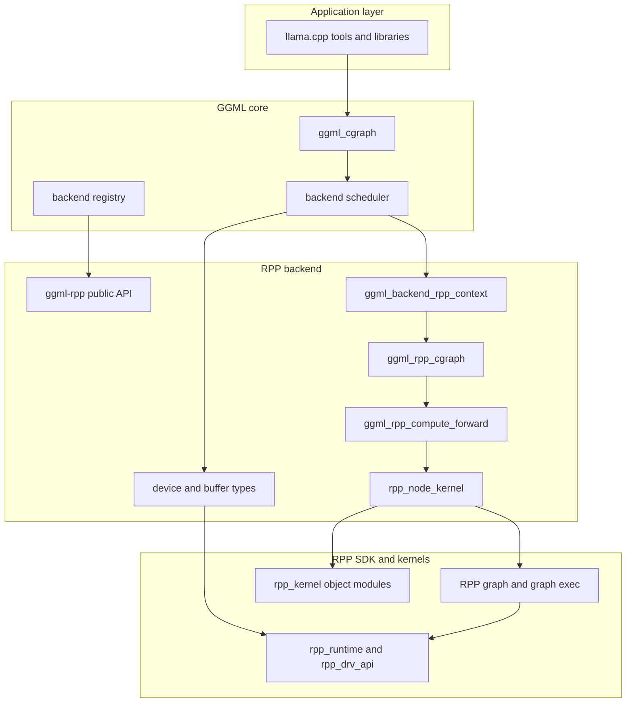
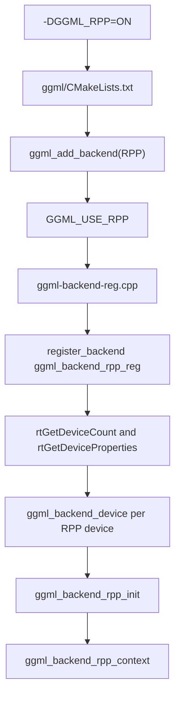
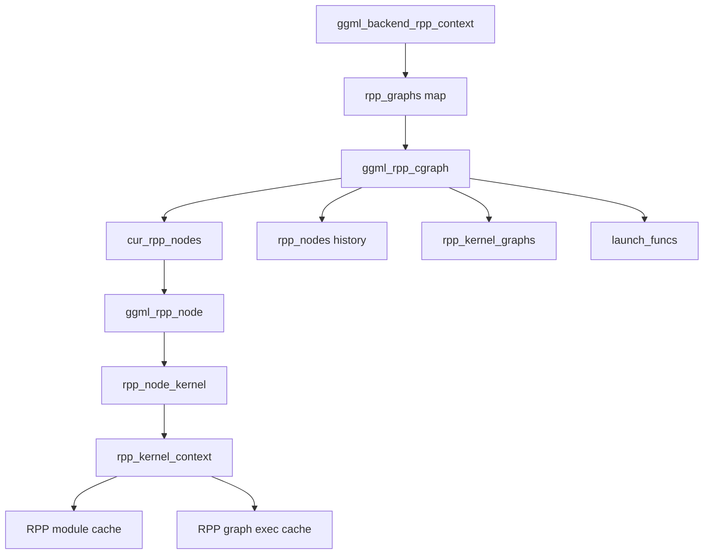
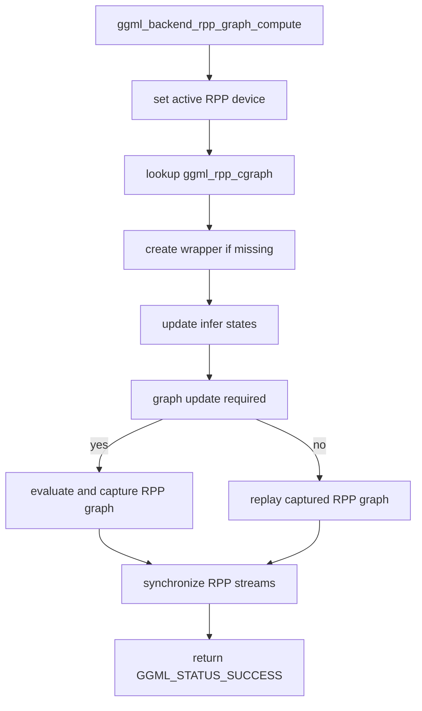
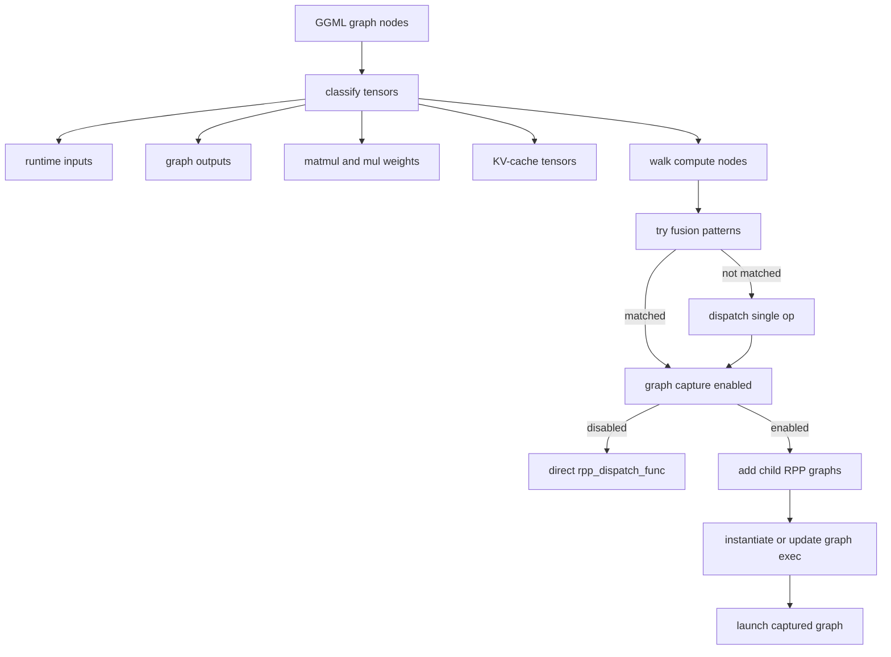
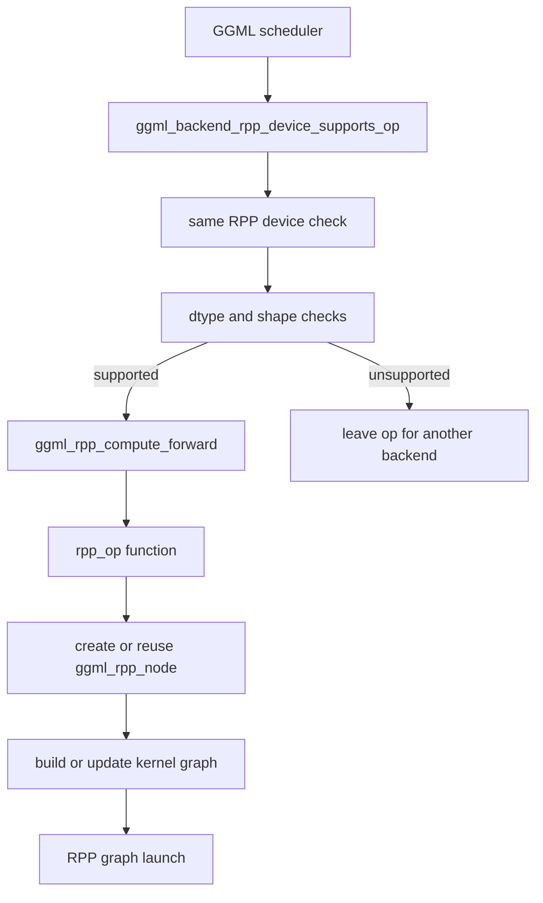
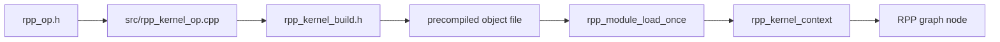
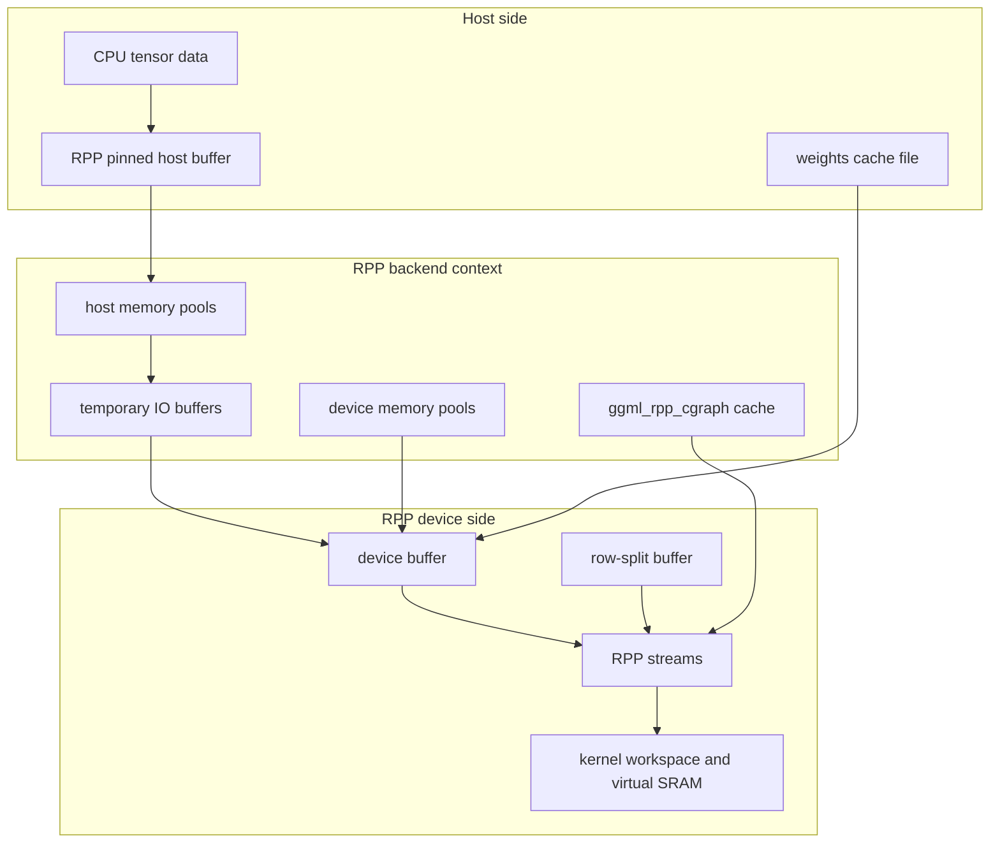
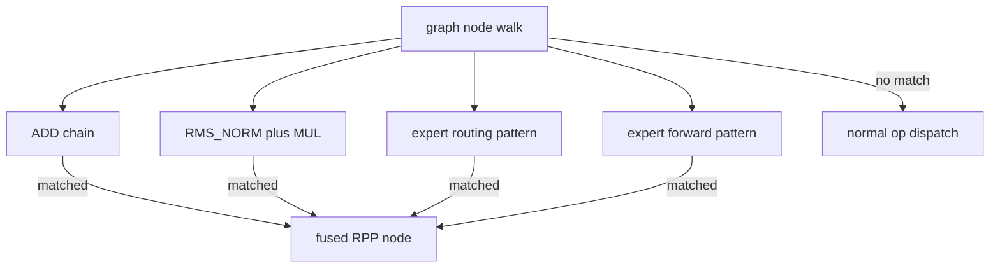

# RPP overall architecture

- [Background](#background)
- [Build integration](#build-integration)
- [Architecture](#architecture)
- [Graph execution flow](#graph-execution-flow)
- [Operation dispatch and kernels](#operation-dispatch-and-kernels)
- [Memory and cache model](#memory-and-cache-model)
- [Fusion and graph reuse](#fusion-and-graph-reuse)
- [Debug and tuning options](#debug-and-tuning-options)
- [Testing](#testing)
- [Limitations and future work](#limitations-and-future-work)

Related design notes:

- [RPP operator mapping](rpp_operator_mapping.md)
- [RPP graph execution](rpp_graph_execution.md)
- [RPP memory management](rpp_memory_management.md)
- [RPP operator execution](rpp_operator_execution.md)
- [RPP quantization support](rpp_quantization_support.md)
- [RPP performance optimization](rpp_performance_optimization.md)

## Background

The RPP backend connects GGML graph execution to the RPP runtime and driver APIs. It is implemented under
`ggml/src/ggml-rpp/` and is exposed to the GGML backend registry through `ggml_backend_rpp_reg()`.

The backend is designed around two execution paths:

- The default kernel path builds RPP graphs from per-op precompiled kernel modules in `rpp_kernel/`.
- The optional OpenRT path is enabled with `GGML_RPP_USE_RT` and uses `Infer.h` / `RppRT` where supported.

Most of the backend control flow is in `ggml/src/ggml-rpp/ggml-rpp.cpp`. Shared runtime state, graph wrappers, and
node types are declared in `ggml/src/ggml-rpp/rpp_common.h`; per-kernel runtime resources are managed by
`ggml/src/ggml-rpp/rpp_kernel_ctx.h`.

## Build integration

Enable the backend with CMake:

```sh
cmake -B build -DGGML_RPP=ON
cmake --build build --config Release
```

`GGML_RPP` is declared in `ggml/CMakeLists.txt`. When it is enabled, `ggml/src/CMakeLists.txt` adds the RPP backend
with `ggml_add_backend(RPP)`, and `ggml/src/ggml-backend-reg.cpp` registers `ggml_backend_rpp_reg()` under
`GGML_USE_RPP`.

The RPP SDK is found through `RPP_INSTALL_DIR`, or through `RPP_HOME` when `RPP_INSTALL_DIR` is not set. If neither is
provided, the backend searches `/usr/local/rpp`.

Important CMake options:

| Option | Default | Purpose |
| --- | --- | --- |
| `GGML_RPP_USE_BF16` | `ON` | Enable BF16-specific backend paths. |
| `GGML_RPP_USE_UBATCH` | `ON` | Enable micro-batch graph variants. |
| `GGML_RPP_USE_ASYNC` | `ON` | Use asynchronous copies and launches. |
| `GGML_RPP_USE_GRAPHS` | `1` | Enable RPP graph capture and replay. |
| `GGML_RPP_NO_PEER_COPY` | `1` | Disable backend events and peer-copy support by default. |
| `GGML_RPP_USE_RT` | `OFF` | Enable the optional OpenRT path. |
| `GGML_RPP_USE_DFS` | `OFF` | Enable dynamic frequency control. |
| `GGML_RPP_USE_DFS_FLEXIBLE` | `OFF` | Enable flexible dynamic frequency control. |
| `GGML_RPP_PERF_TRACE` | `OFF` | Enable Perfetto tracing through `rpp_perf`. |
| `GGML_RPP_DUMP_OPS` | `OFF` | Dump GGML graph operation information during graph compute. |

The build copies precompiled kernel objects from the per-op directories into `<build>/bin/rpp_kernel/`. The same
directory is installed under `${CMAKE_INSTALL_BINDIR}/rpp_kernel`, and RPP tests run from `${CMAKE_BINARY_DIR}/bin` so
the kernel objects are found at runtime.

## Architecture

The RPP backend follows the normal GGML backend model: GGML owns the tensor graph and scheduling decision, while the
RPP backend owns device buffers, graph lowering, kernel graph capture, and runtime launches.



The RPP-to-llama.cpp interface class diagram is available as a Visio source file:
[llama.cpp_class.vsdx](images/llama.cpp_class.vsdx). Use it together with the architecture diagram above when reviewing
the registration path, backend interface objects, and RPP runtime ownership boundaries.

The important boundary is between `ggml_cgraph` and `ggml_rpp_cgraph`. `ggml_cgraph` is the frontend graph produced by
GGML. `ggml_rpp_cgraph` is the backend-side wrapper that records which tensors are inputs, outputs, weights, and
KV-cache tensors, and which RPP nodes and captured graphs can be reused for later launches.

### Public API and registration

The public backend API is declared in `ggml/include/ggml-rpp.h`:

- `ggml_backend_rpp_reg()` exposes the backend registry.
- `ggml_backend_rpp_init()` creates a backend instance for one RPP device.
- `ggml_backend_rpp_buffer_type()` returns a device buffer type.
- `ggml_backend_rpp_split_buffer_type()` returns a row-split buffer type for matrix weights across devices.
- `ggml_backend_rpp_host_buffer_type()` returns the pinned host buffer type when pinned memory is enabled.
- Device discovery and memory queries are exposed through `ggml_backend_rpp_get_device_count()`,
  `ggml_backend_rpp_get_device_description()`, and `ggml_backend_rpp_get_device_memory()`.

Registration happens in two steps. CMake first enables the backend and compiles `ggml-rpp`; then runtime registration
creates GGML backend devices from the RPP devices found by the SDK.



`ggml_backend_rpp_reg()` is a lazy singleton. It creates one `ggml_backend_device` per RPP device and exposes
`ggml_backend_get_features` and `ggml_backend_set_params` through the backend proc-address hook. Dynamic backend loading
is supported through `GGML_BACKEND_DL_IMPL(ggml_backend_rpp_reg)`.

### Runtime object model

The backend has three nested lifetimes:

- Backend lifetime: one `ggml_backend_rpp_context` per initialized RPP backend.
- GGML graph lifetime: one cached `ggml_rpp_cgraph` per `ggml_cgraph`.
- Kernel graph lifetime: one or more `rpp_kernel_cgraph` objects per graph shape and micro-batch variant.



The main runtime objects are:

| Object | Location | Role |
| --- | --- | --- |
| `ggml_backend_rpp_context` | `rpp_common.h` | Per-backend state: device, streams, domain, batch settings, graph cache, memory pools, RoPE caches. |
| `ggml_rpp_cgraph` | `rpp_common.h` | Wrapper around one `ggml_cgraph`, including classified inputs/outputs/weights, live RPP nodes, launch functions, and captured kernel graphs. |
| `ggml_rpp_node` | `rpp_common.h` | Base class for one lowered GGML op. Each node implements `rpp_dispatch_func()`. |
| `rpp_node_kernel` | `rpp_common.h` | Default node type that owns or shares an `rpp_kernel_context`. |
| `rpp_kernel_context` | `rpp_kernel_ctx.h` | RPP module, graph, graph exec, streams, events, virtual SRAM, and device workspaces for one kernel graph. |
| `rpp_kernel_cgraph` | `rpp_common.h` | Captured parent graph that groups child per-op RPP graphs for replay. |

## Graph execution flow

For a detailed explanation of rebuild, capture, replay, shared/exclusive graph grouping, and child graph exec updates,
see [RPP graph execution](rpp_graph_execution.md).

Graph execution starts in `ggml_backend_rpp_graph_compute()`. The function either reuses a previously captured RPP graph
or rebuilds the RPP-side graph state when the GGML graph shape, node properties, or inference phase changes.



1. Select the RPP device for the backend context.
2. Look up or create a `ggml_rpp_cgraph` wrapper for the incoming `ggml_cgraph`.
3. Call `update_ggml_rpp_infer_states()` to handle graph and node state transitions.
4. Check whether the wrapped graph must be rebuilt with `is_rpp_graph_update_required()`.
5. Evaluate or replay the graph through `evaluate_and_capture_rpp_graph()`.
6. Synchronize all streams created for the active device.

When the graph needs rebuilding, `evaluate_and_capture_rpp_graph()` classifies GGML tensors into graph inputs,
outputs, matmul weights, multiply weights, and KV-cache tensors. It then walks graph nodes and either applies a fused
path or dispatches the node through `ggml_rpp_compute_forward()`.



If graph capture is enabled, per-op RPP graphs are added as child graphs to a shared `rpp_kernel_cgraph`. The captured
graph is indexed by a key derived from the active RPP node count and `n_ubatch`. Reused graphs update their child graph
execs instead of rebuilding all kernel contexts.

`GGML_OP_MUL_MAT_ID` is treated as an exclusive graph op and receives its own captured graph. Other supported kernel
ops can be grouped into a shared parent graph.

## Operation dispatch and kernels

For per-operator implementation notes, see [RPP operator execution](rpp_operator_execution.md). For GGML-node to
RPP-node mapping and reuse, see [RPP operator mapping](rpp_operator_mapping.md).

The central dispatcher is `ggml_rpp_compute_forward()` in `ggml-rpp.cpp`. It maps supported GGML ops to per-op
functions such as `ggml_rpp_op_mul_mat()`, `ggml_rpp_op_rms_norm()`, `ggml_rpp_op_rope()`, and
`ggml_rpp_op_flash_attn_ext()`.



The device capability gate is `ggml_backend_rpp_device_supports_op()`. It rejects split buffers for non-`MUL_MAT`
ops, requires RPP buffers to be on the same device, and checks op-specific dtype and shape constraints before the
scheduler offloads an op to RPP.

Currently dispatched op families include:

- Elementwise and layout: `ADD`, `MUL`, `DIV`, `CPY`, `CONT`, `SCALE`.
- Normalization: `NORM`, `RMS_NORM`, `L2_NORM`.
- Indexing and KV-cache helpers: `GET_ROWS`, `SET_ROWS`.
- Matrix operations: `MUL_MAT`, `MUL_MAT_ID`.
- Model operations: `ROPE`, `GLU`, `FLASH_ATTN_EXT`, `POOL_2D`.
- Fused or helper paths: reduce-sum fusion, RMS norm + multiply fusion, expert routing, expert forward.

Each operation is organized as an `rpp_<op>/` module. The common layout is:

- `rpp_<op>.h` declares the node and operation entry points.
- `src/rpp_kernel_<op>.cpp` builds or updates the RPP kernel graph bindings.
- `kernel/` or `kernel_<variant>/` contains precompiled objects and `rpp_kernel_build.h` graph-building code.



`rpp_mul_mat` has the widest kernel matrix. It includes BF16, Q8_0, Q6_K, Q5_K, Q4_K, Q4_1, IQ3_XXS, IQ2_S, and
IQ2_XS variants, with additional `_vxm` and `_nolut` forms where implemented.

## Memory and cache model

The backend exposes three main buffer types:

| Buffer type | Purpose |
| --- | --- |
| `ggml_backend_rpp_buffer_type(device)` | Device memory allocated by the RPP runtime. |
| `ggml_backend_rpp_host_buffer_type()` | Pinned host memory, disabled when `GGML_RPP_NO_PINNED` is set. |
| `ggml_backend_rpp_split_buffer_type(main_device, tensor_split)` | Row-split tensor storage for multi-device matrix weights. |



`ggml_backend_rpp_context` owns lazy device and host memory pools for regular, legacy, and memory-backed allocations.
It also tracks per-device streams, graph wrappers, temporary IO buffers, and RoPE sine/cosine caches.

Quantized weights can use an on-disk repacking cache. Set `GGML_RPP_WEIGHTS_CACHE_FILE` to a cache path to enable this
path. The cache file stores a backend-specific magic and version so incompatible files can be rejected.

## Fusion and graph reuse

Fusion is applied while rebuilding a graph, before the normal per-op dispatcher is called. Current fusion paths include:

- Consecutive `ADD` nodes lowered to a reduce-sum path.
- `RMS_NORM` followed by `MUL`.
- Expert routing around `SOFT_MAX`.
- Expert forward around `MUL_MAT_ID` and related MoE nodes.

Set `GGML_RPP_DISABLE_FUSION=1` to disable these fusion paths.



Graph capture is enabled by default when `GGML_RPP_USE_GRAPHS` is active. Set `GGML_RPP_DISABLE_GRAPH_CAPTURE=1` to
dispatch nodes directly through `rpp_dispatch_func()` instead of capturing or replaying parent RPP graphs.

Micro-batching is controlled by `GGML_RPP_USE_UBATCH` and the runtime `GGML_RPP_BATCH_SIZE` value. The backend context
also tracks `GGML_RPP_MAX_CONTEXT` and `GGML_RPP_STUB_KV_STEP`. The proc-address extension
`ggml_backend_set_params` can set the backend domain, micro-batch size, and maximum context; vision and audio domains
disable ubatching.

## Debug and tuning options

Runtime environment variables:

| Variable | Purpose |
| --- | --- |
| `GGML_RPP_BATCH_SIZE` | Override `n_ubatch` in the backend context. |
| `GGML_RPP_MAX_CONTEXT` | Override the maximum context tracked by the backend context. |
| `GGML_RPP_STUB_KV_STEP` | Override the KV-cache stub step. |
| `GGML_RPP_DISABLE_FUSION` | Disable fusion during graph rebuild. |
| `GGML_RPP_DISABLE_GRAPH_CAPTURE` | Disable RPP graph capture and replay. |
| `GGML_RPP_WEIGHTS_CACHE_FILE` | Enable the quantized weights cache at the given path. |
| `GGML_RPP_NO_PINNED` | Disable pinned host allocation. |
| `GGML_RPP_REGISTER_HOST` | Enable explicit host buffer registration helpers. |

Debug-oriented kernel variables also exist for selected kernels, for example Q6_K bypass paths and pool-2D dumps. Treat
those as kernel-specific diagnostics rather than stable user-facing configuration.

Compile-time diagnostics:

- `GGML_RPP_DUMP_OPS=ON` dumps the GGML graph operation list and dot graph during graph compute.
- `GGML_RPP_PERF_TRACE=ON` enables Perfetto tracing if `rpp_perf` is available in the RPP SDK.
- `GGML_RPP_USE_DFS=ON` and `GGML_RPP_USE_DFS_FLEXIBLE=ON` enable DFS-related tuning paths.

The registry also exposes `ggml_backend_get_features`, reporting selected compile-time feature values such as graph,
ubatch, async, peer-copy, and engine settings.

## Testing

RPP tests are enabled when `GGML_RPP` is enabled. `tests/CMakeLists.txt` adds `tests/tests_rpp`, and
`tests/tests_rpp/CMakeLists.txt` builds each test with `ggml-rpp` and labels it `rpp`.

Run the RPP test label from a build configured with `-DGGML_RPP=ON`:

```sh
ctest --test-dir build -L rpp --output-on-failure
```

The unit tests cover individual ops including add, copy, contiguous conversion, argsort, flash attention, GLU, multiply,
RMS norm, RoPE, sum/reduce rows, divide, set/get rows, scale, norm, RMS norm + multiply fusion, `MUL_MAT_ID`, quantized
`MUL_MAT`, and MoE GLU paths.

Model-shaped tests under `tests/tests_rpp/` cover Qwen3, Qwen3.5, Qwen3-VL, and Phi-4 ViT style graphs. These tests
exercise the same backend code through graph shapes closer to real model execution, including quantized matmul, RoPE,
GLU, flash attention, KV row ops, and vision/projector paths.

## Limitations and future work

The backend intentionally gates support through `ggml_backend_rpp_device_supports_op()`. Unsupported ops should remain
on another backend rather than reaching `ggml_rpp_compute_forward()`.

Areas that need continued validation:

- Keep `supports_op` dtype and shape checks aligned with the actual per-kernel implementation.
- Expand kernel coverage only when there is a matching test under `tests/tests_rpp/`.
- Keep graph capture and direct-dispatch behavior equivalent by testing with and without
  `GGML_RPP_DISABLE_GRAPH_CAPTURE`.
- Document hardware and SDK version requirements once the supported RPP platform matrix is finalized.
- Split this document into `docs/backend/RPP/` subdocuments only if build, platform, or kernel-development details grow
  beyond a single backend guide.
