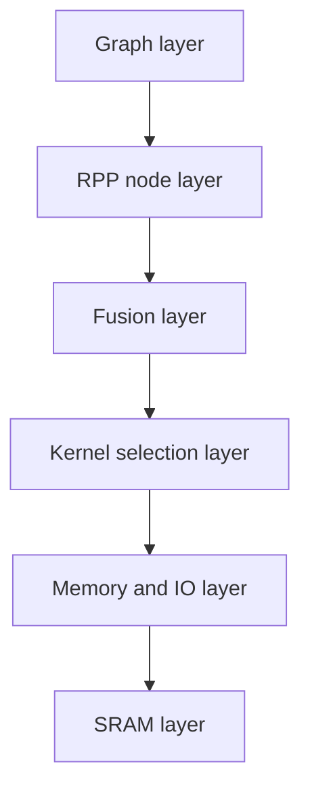
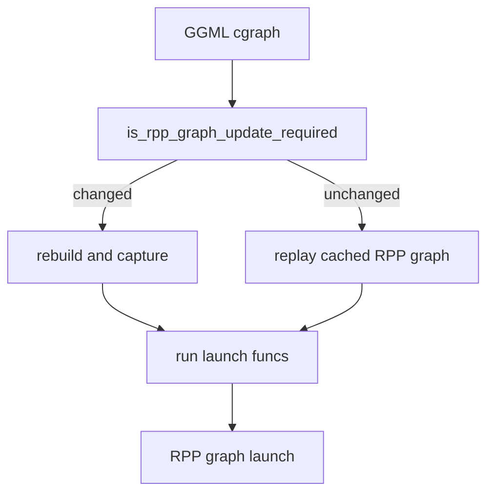
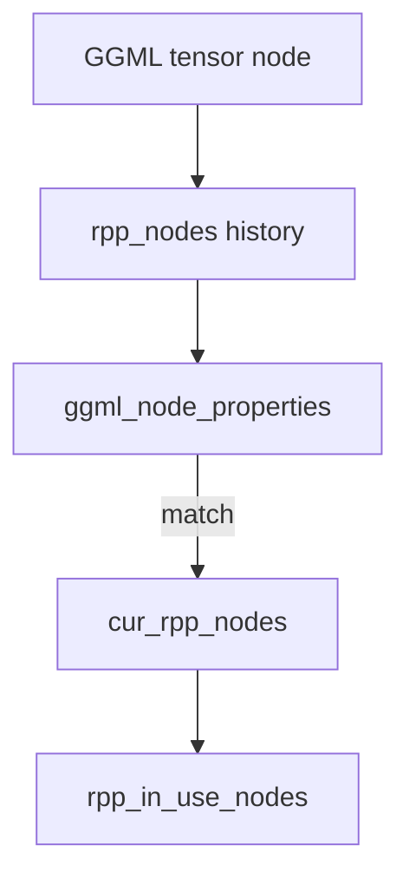
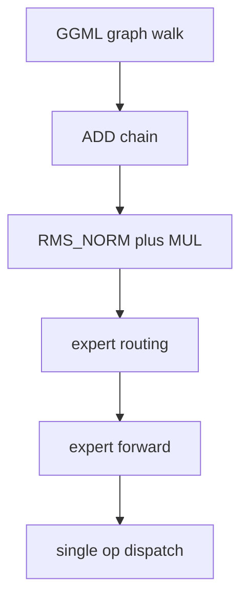
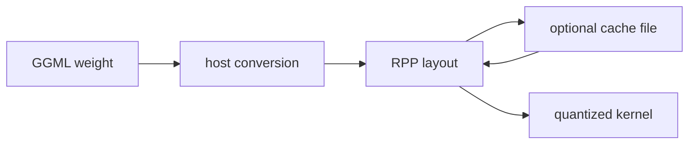
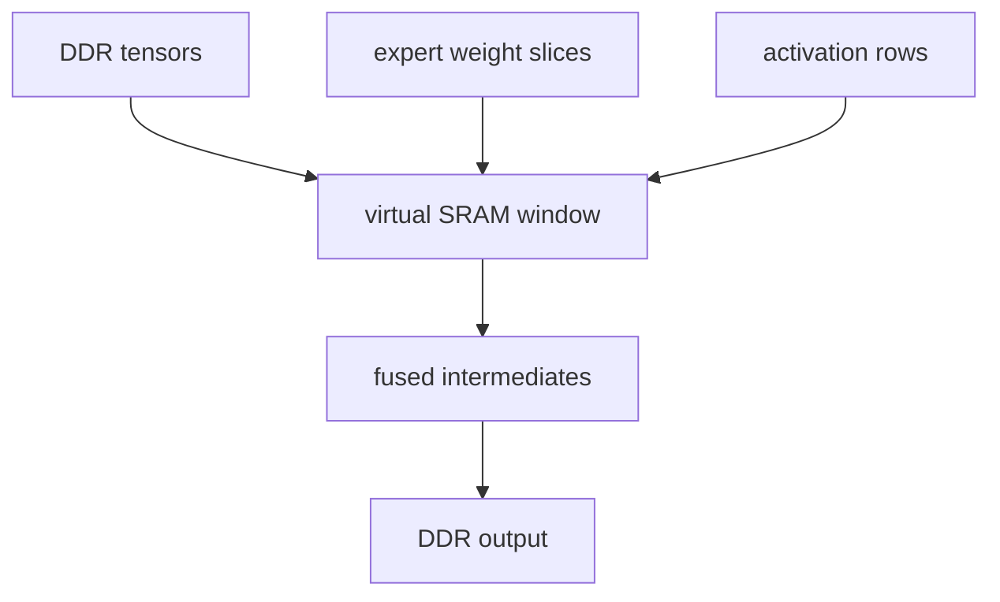
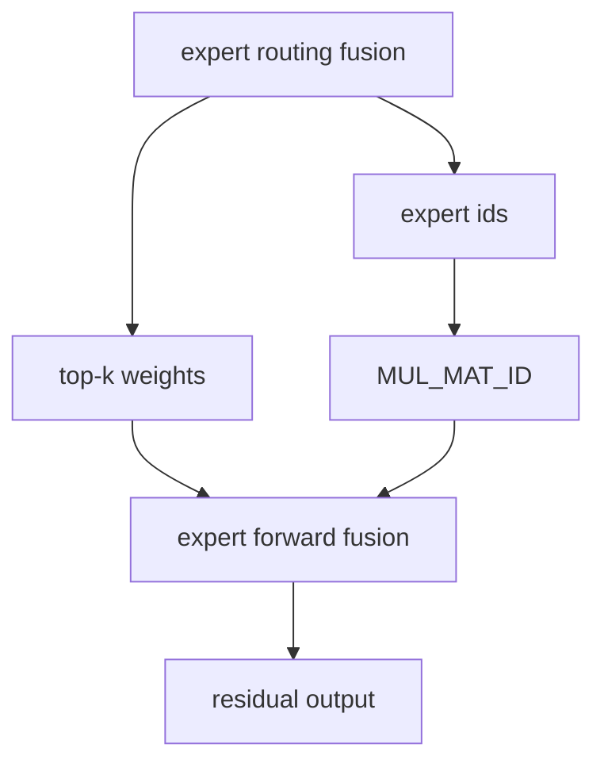

# RPP performance optimization

This document summarizes the performance techniques used by the RPP backend. It focuses on why the backend is structured
the way it is, what each optimization reduces, and which trade-offs or debug switches are relevant.

Related documents:

- [RPP graph execution](rpp_graph_execution.md) explains graph rebuild, capture, replay, and child graph updates.
- [RPP operator mapping](rpp_operator_mapping.md) explains how GGML nodes are mapped to reusable RPP nodes.
- [RPP operator execution](rpp_operator_execution.md) explains per-operator build, binding, workspace, and launch logic.
- [RPP quantization support](rpp_quantization_support.md) explains converted quantized weight layouts.
- [RPP memory management](rpp_memory_management.md) explains pools, tensor data, weights, and SRAM lifetime.

- [Optimization layers](#optimization-layers)
- [Graph-level optimization](#graph-level-optimization)
- [Node and kernel reuse](#node-and-kernel-reuse)
- [Fusion optimization](#fusion-optimization)
- [Quantization and weight upload](#quantization-and-weight-upload)
- [Data movement optimization](#data-movement-optimization)
- [SRAM optimization](#sram-optimization)
- [Expert-path optimization](#expert-path-optimization)
- [Shape and ubatch optimization](#shape-and-ubatch-optimization)
- [Workspace and memory-pool reuse](#workspace-and-memory-pool-reuse)
- [Debug and tuning knobs](#debug-and-tuning-knobs)
- [Optimization checklist](#optimization-checklist)

## Optimization layers

RPP performance work is layered. A graph launch can be fast only when the backend avoids repeated graph construction,
unnecessary host/device copies, redundant weight conversion, and avoidable DDR traffic.

| Layer | Main goal | Examples |
| --- | --- | --- |
| Graph | Avoid rebuilding launch graphs | graph capture/replay, child graph exec update |
| Node | Reuse compiled kernel state | `rpp_nodes`, `cur_rpp_nodes`, `ggml_node_properties` |
| Fusion | Reduce intermediate nodes and launches | reduce-sum fusion, RMS+MUL, expert routing, expert forward |
| Kernel | Pick shape-specific kernels | VXM decode kernels, batched prefill kernels, no-LUT IQ kernels |
| Memory | Reduce allocation and conversion overhead | memory pools, converted weight cache, workspace sharing |
| SRAM | Keep hot intermediates near compute | IQ decode SRAM paths, expert-forward SRAM fusion |

## Graph-level optimization

The default path uses graph capture and replay instead of launching every RPP kernel as an independent host operation.

What it optimizes:

- repeated RPP graph construction
- repeated graph instantiation
- per-op launch overhead from the host
- unchanged graph replay across tokens or layers

Important implementation details:

- `ggml_backend_rpp_graph_compute()` caches one `ggml_rpp_cgraph` per `ggml_cgraph *`.
- `is_rpp_graph_update_required()` compares node count, tensor addresses, op type, shape, stride, source addresses, and
  selected op params.
- `evaluate_and_capture_rpp_graph()` rebuilds only when needed; otherwise it reuses `rpp_in_use_kernel_graphs`.
- Captured graph cache keys include active RPP node count and `n_ubatch`, so prefill and decode can use different graph
  variants.

Trade-off:

- Captured graphs must be updated carefully when the selected child RPP node changes.
- Direct dispatch remains useful for debugging because it removes the graph replay layer while keeping operator mapping.

## Node and kernel reuse

The RPP backend keeps historical nodes and selects current nodes for each launch.

What it optimizes:

- repeated kernel context allocation
- repeated module loading and graph building
- repeated workspace allocation
- repeated property analysis for stable shapes

Important implementation details:

- `rpp_nodes` stores historical RPP nodes for a GGML tensor.
- `cur_rpp_nodes` maps the current graph launch to the selected RPP node.
- `rpp_in_use_nodes` preserves the launch order for graph capture or direct dispatch.
- `ggml_node_properties` snapshots tensor address, op, shape, stride, source addresses, and op params.
- Ubatch-aware property checks allow prefill shapes to reuse kernels while rejecting decode/prefill mismatches.

## Fusion optimization

Fusion happens during graph rebuild before normal single-op dispatch.

What it optimizes:

- fewer RPP nodes in the captured graph
- fewer kernel launches
- fewer intermediate tensors written to DDR
- less host-side graph scheduling work

Current fusion paths:

- ADD chain to `rpp_reduce_sum`
- `RMS_NORM -> MUL` to fused RMS scale
- expert routing fusion around softmax, argsort, top-k id extraction, and weight normalization
- expert forward fusion around gate/up/down expert matmuls, SwiGLU, top-k combine, and residual add

Trade-offs:

- Fusion matchers intentionally require stable graph patterns.
- Expert routing registers runtime skips for replaced nodes.
- Expert forward uses a gate-anchored fusion path and does not use the same runtime skip mechanism.
- Fusion can be disabled with `GGML_RPP_DISABLE_FUSION=1` to compare fused and unfused behavior.

## Quantization and weight upload

RPP kernels consume converted weight layouts rather than the original GGML quant block layout.

What it optimizes:

- kernel input layout matches RPP kernels
- dense weights are stored as BF16-oriented padded layout
- quantized sections are pre-split into kernel-friendly buffers
- repeated process startup can skip conversion with the on-disk cache

Important implementation details:

- `ggml_backend_rpp_buffer_set_tensor()` converts matmul weights during upload.
- `ggml_rpp_get_matmul_weight_converted_size()` predicts converted sizes for cache lookup.
- `GGML_RPP_WEIGHTS_CACHE_FILE` stores converted payloads, not original GGML blocks.
- IQ formats currently use no-LUT converted layouts in active dispatch.
- `M == 1` selects VXM decode kernels for many quantized types.

Trade-off:

- Weight upload is more expensive on a cache miss, but the converted layout makes runtime kernels simpler and faster.
- Cache entries should be cleared when converted layout code changes.

## Data movement optimization

The backend tries to avoid unnecessary host/device and DDR/SRAM traffic, but it also uses staging when that enables a
faster kernel path.

| Mechanism | Where used | Purpose |
| --- | --- | --- |
| Direct tensor binding | most contiguous operators | Avoid copy before launch. |
| Pool staging | ADD non-contiguous inputs, `MUL_MAT_ID` DDR path | Make kernel inputs contiguous or expert-local. |
| Launch-time packing | ADD | Pack non-contiguous inputs only when needed. |
| Dynamic IO update | CONT DMA, ROPE, expert-forward weights | Reuse captured graphs while updating runtime addresses or metadata. |
| Row-id register update | GET_ROWS, SET_ROWS | Avoid rebuilding kernels for changing row spans. |
| Device-to-SRAM copies | IQ decode and expert forward | Move hot data into SRAM before compute. |

Examples:

- ADD supports non-contiguous sources by packing them into pool buffers before launch.
- CONT DMA mode updates dynamic D0 at launch time so the captured graph can be reused.
- ROPE uses an IO update graph to copy the current sin/cos slice from global cache into per-node buffers.
- `MUL_MAT_ID` uses DDR staging for generic per-expert launches and SRAM staging for IQ decode.

## SRAM optimization

SRAM is used when the cost of DDR traffic dominates the kernel path. The backend treats the 24 MiB compute SRAM as a
scarce resource and uses a conservative 22 MiB virtual-SRAM working window.

What it optimizes:

- repeated DDR reads of small decode activations
- intermediate DDR writes in fused expert forward
- expert weight switching overhead in decode paths

Key SRAM users:

- `MUL_MAT_ID` IQ decode no-LUT SRAM path
- expert-forward decode fusion
- GLU SRAM-direct helper path, although normal dispatch currently does not enable it

Important constraints:

- Expert-forward decode computes a combined SRAM layout for gate, up, GLU, down, div, and add intermediates.
- If the computed layout exceeds 22 MiB, the fusion is skipped.
- IQ prefill and decode have different workspace/SRAM requirements, so workspace reuse checks `n_ubatch`.

## Expert-path optimization

MoE models have performance pressure from routing, per-expert matmul, top-k combine, and residual accumulation. RPP has
several expert-specific optimizations.

Optimization mechanisms:

- expert routing fusion replaces softmax/argsort/get_rows/sum_rows/div chains
- `MUL_MAT_ID` decode uses per-expert VXM kernels
- `MUL_MAT_ID` ubatch path sorts tokens by expert, gathers activations, processes expert batches, and unscatters output
- expert-forward prefill builds route metadata and uses ping-pong execution plans
- expert-forward decode keeps gate/up/GLU/down/top-k combine in SRAM

Trade-offs:

- Expert fusion matchers are intentionally strict.
- Expert-forward fusion supports only IQ2/IQ3 no-LUT expert weights.
- The prefill path has a token-count-per-expert limit tied to `ctx.n_ubatch`.

## Shape and ubatch optimization

RPP separates decode-like and prefill-like shapes.

What it optimizes:

- decode uses `M == 1` VXM kernels where available
- prefill uses `ctx.n_ubatch` to keep graph variants stable
- property checks can reuse prefill kernels across compatible sequence shapes
- graph cache keys include `n_ubatch` to avoid mixing incompatible graph variants

Important knobs:

- `GGML_RPP_USE_UBATCH` enables micro-batch graph variants at build time.
- `GGML_RPP_BATCH_SIZE` can override `n_ubatch` in the backend context.

## Workspace and memory-pool reuse

Many kernels need small DDR workspaces or temporary buffers. RPP tries to reuse them rather than allocating per node.

Examples:

- DIV shares the reciprocal lookup table workspace.
- RMS_NORM, NORM, L2_NORM, GLU, FLASH_ATTN_EXT, and matmul families reuse the first compatible node's workspace.
- Device and host pools serve temporary staging buffers.
- Weight conversion uses pinned host memory for temporary converted payloads.

What it optimizes:

- fewer runtime allocations
- lower graph rebuild cost
- lower memory fragmentation
- stable addresses for captured graph reuse

## Debug and tuning knobs

| Knob | Purpose |
| --- | --- |
| `GGML_RPP_DISABLE_GRAPH_CAPTURE=1` | Use direct dispatch instead of captured graph replay. |
| `GGML_RPP_DISABLE_FUSION=1` | Disable fusion during graph rebuild. |
| `GGML_RPP_WEIGHTS_CACHE_FILE=/path/to/cache` | Cache converted weight layouts on disk. |
| `GGML_RPP_BATCH_SIZE=<n>` | Override `n_ubatch`. |
| `GGML_RPP_STUB_KV_STEP=<n>` | Control flash-attention KV stub ladder length. |
| `GGML_RPP_DUMP_OPS=ON` | Dump GGML op list and dot graph during graph compute. |
| `GGML_RPP_PERF_TRACE=ON` | Enable Perfetto tracing windows around selected graph phases. |
| `GGML_RPP_USE_DFS=ON` | Enable dynamic frequency scaling paths. |
| `GGML_RPP_USE_DFS_FLEXIBLE=ON` | Enable flexible dynamic frequency scaling paths. |

Useful comparisons:

- captured graph vs direct dispatch: set `GGML_RPP_DISABLE_GRAPH_CAPTURE=1`
- fused vs unfused graph: set `GGML_RPP_DISABLE_FUSION=1`
- weight conversion cost: compare cold start with and without `GGML_RPP_WEIGHTS_CACHE_FILE`
- ubatch sensitivity: vary `GGML_RPP_BATCH_SIZE`
- flash attention KV prebuild behavior: vary `GGML_RPP_STUB_KV_STEP`

## Optimization checklist

When investigating performance, check these in order:

1. Is the op scheduled to RPP by `ggml_backend_rpp_device_supports_op()`?
2. Is the graph rebuilding every token, or is it replaying captured graphs?
3. Are RPP nodes reused, or do property checks force new nodes?
4. Did fusion match the expected graph pattern?
5. Is decode using VXM kernels where expected?
6. Is prefill using the intended `n_ubatch`?
7. Are quantized weights converted once and optionally loaded from cache?
8. Are hot expert decode paths using SRAM rather than DDR staging?
9. Are workspace buffers shared across compatible nodes?
10. Are non-contiguous tensors causing launch-time packing or fallback paths?

Performance changes should usually be validated in both modes:

- default captured graph mode
- direct dispatch mode with `GGML_RPP_DISABLE_GRAPH_CAPTURE=1`

This helps separate kernel-level speedups from graph-capture or child-graph-update behavior.
