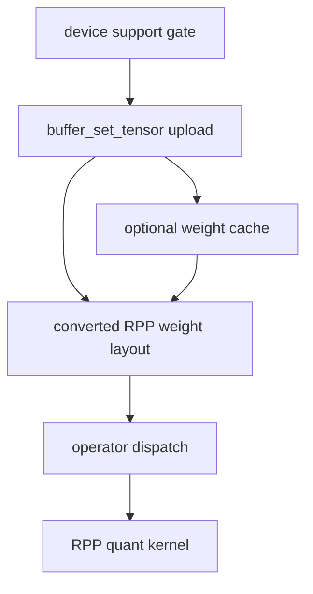
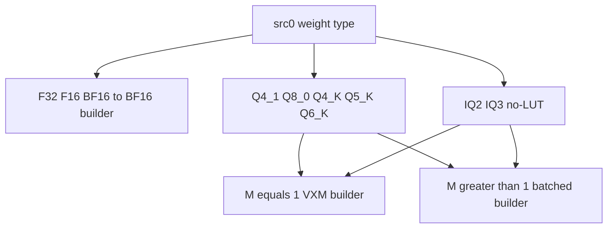
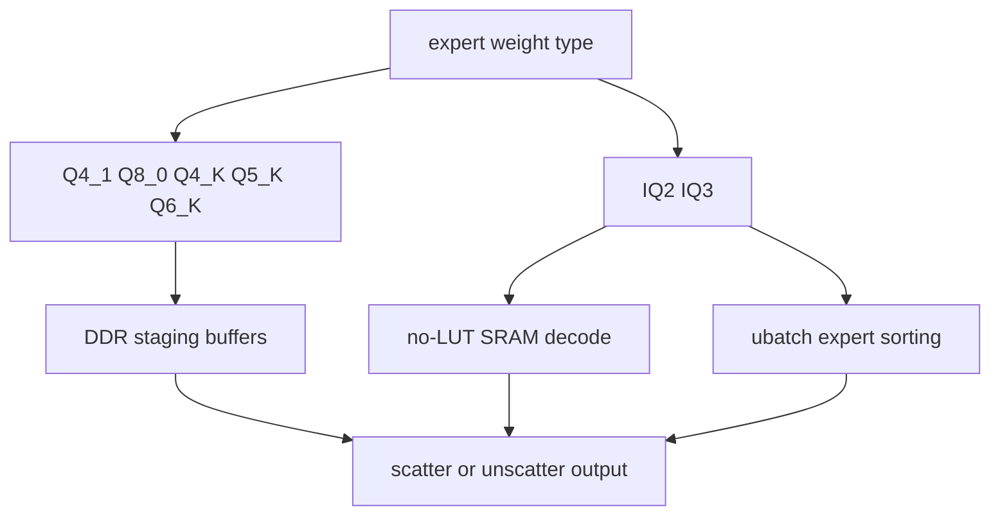
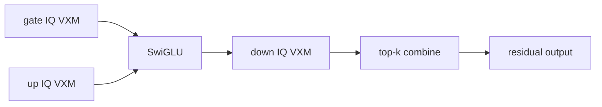
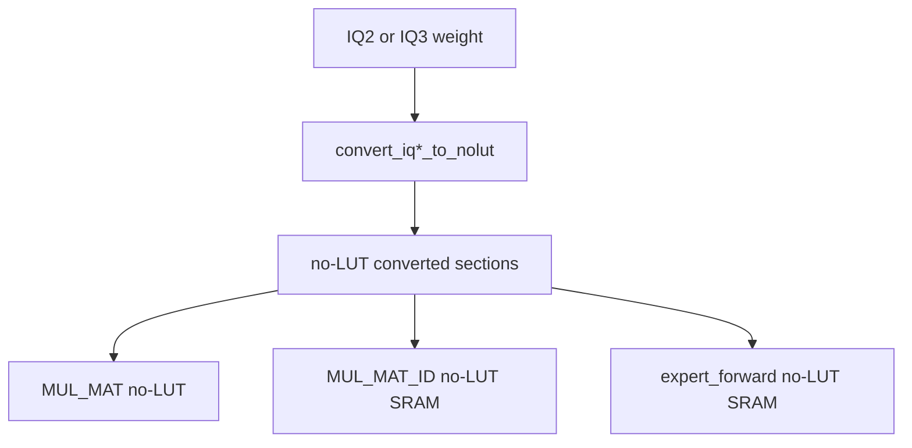

# RPP quantization support

This document describes how the RPP backend supports quantized matrix weights. It complements
[RPP operator execution](rpp_operator_execution.md) and [RPP memory management](rpp_memory_management.md):

- operator execution explains how `MUL_MAT`, `MUL_MAT_ID`, and expert fusions run
- memory management explains tensor ownership, upload, pools, and the weight cache
- this document explains which quantized types are supported, how their converted layouts are organized, and which
  kernel variants consume those layouts

- [Support matrix](#support-matrix)
- [Where quantization enters the backend](#where-quantization-enters-the-backend)
- [Weight upload and conversion](#weight-upload-and-conversion)
- [Converted weight layouts](#converted-weight-layouts)
- [MUL_MAT dispatch](#mul_mat-dispatch)
- [MUL_MAT_ID dispatch](#mul_mat_id-dispatch)
- [Expert forward fusion](#expert-forward-fusion)
- [IQ no-LUT and SRAM paths](#iq-no-lut-and-sram-paths)
- [Weight cache](#weight-cache)
- [Limitations and debugging](#limitations-and-debugging)

## Support matrix

The RPP device support gate accepts the following weight types for matrix operators.

| Weight type | `MUL_MAT` | `MUL_MAT_ID` | Expert forward fusion | Main notes |
| --- | --- | --- | --- | --- |
| `GGML_TYPE_F32` | Yes | Yes | No | Uploaded as padded RPP BF16 layout. |
| `GGML_TYPE_F16` | Yes | No | No | Uploaded as padded RPP BF16 layout. |
| `GGML_TYPE_BF16` | Yes | No | No | Uploaded as padded RPP BF16 layout. |
| `GGML_TYPE_Q4_1` | Yes | Yes | No | Supports VXM decode and batched paths. |
| `GGML_TYPE_Q8_0` | Yes | Yes | No | Supports VXM decode and batched paths. |
| `GGML_TYPE_Q4_K` | Yes | Yes | No | Supports VXM decode and batched paths. |
| `GGML_TYPE_Q5_K` | Yes | Yes | No | Supports VXM decode and batched paths. |
| `GGML_TYPE_Q6_K` | Yes | Yes | No | Supports VXM decode and batched paths. |
| `GGML_TYPE_IQ3_XXS` | Yes | Yes | Yes | Current dispatch uses no-LUT layouts. |
| `GGML_TYPE_IQ2_S` | Yes | Yes | Yes | Current dispatch uses no-LUT layouts. |
| `GGML_TYPE_IQ2_XS` | Yes | Yes | Yes | Current dispatch uses no-LUT layouts. |

`MUL_MAT_ID` additionally requires:

- activation input `src[1]` is `GGML_TYPE_F32`
- expert id input `src[2]` is `GGML_TYPE_I32`
- output `dst` is `GGML_TYPE_F32`

Expert forward fusion is intentionally narrower. It only accepts IQ2/IQ3 expert weights because the fusion is built
around VXM no-LUT expert matmul kernels, SRAM staging, and top-k combine.

## Where quantization enters the backend

Quantization support crosses three layers:



The important implementation points are:

- `ggml_backend_rpp_device_supports_op()` decides which quantized GGML ops may be scheduled on RPP.
- `ggml_backend_rpp_buffer_set_tensor()` converts model weights during upload when `is_matmul_weight(tensor)` is true.
- `ggml_rpp_get_matmul_weight_converted_size()` predicts converted size and enables cache lookup.
- `rpp_mul_mat/src/rpp_kernel_mul_mat.cpp` consumes converted 2-D matrix weights.
- `rpp_mul_mat_id/src/rpp_kernel_mul_mat_id.cpp` consumes converted 3-D expert weights.
- `rpp_expert_forward/src/rpp_kernel_expert_forward.cpp` consumes IQ no-LUT expert weights in fused MoE paths.

## Weight upload and conversion

RPP does not directly consume the original GGML quant block layout for matmul weights. During tensor upload, the backend
converts each `[K, N]` weight matrix into a layout expected by the RPP kernels.


For expert weights, `tensor->ne[2]` is treated as the expert count. Conversion is repeated per expert and the converted
expert slices are stored contiguously:

```text
expert 0 converted layout
expert 1 converted layout
...
expert N converted layout
```

Dense `F32`, `F16`, and `BF16` weights are converted into padded BF16-oriented RPP layout. `K` and `N` are rounded up to
32 when calculating the converted dense weight size.

Quantized weights are converted into packed sections. The RPP kernels then pass those sections as separate `dev_in`
entries by pointer arithmetic over `src[0]->data`.

## Converted weight layouts

The converted buffer layout is type-specific. In the formulas below:

- `K = weight->ne[0]`
- `N = weight->ne[1]`
- `QK_K = 256`
- section sizes are per expert

| Type | Converted sections, in order |
| --- | --- |
| `F32` / `F16` / `BF16` | `bf16_weights` with `K` and `N` padded to multiples of 32 |
| `Q4_1` | `weights`, `scales`, `zeros` |
| `Q8_0` | `weights`, `scales` |
| `Q6_K` | `weights_ql`, `weights_qh`, `scales`, `super_scales` |
| `Q4_K` | `weights_q`, `scale_lsb`, `zero_lsb`, `scale_msb`, `zero_msb`, `super_scale`, `super_zero` |
| `Q5_K` | `weights_lsb`, `weights_msb`, `scale_lsb`, `zero_lsb`, `scale_msb`, `zero_msb`, `super_scale`, `super_zero` |
| `IQ3_XXS` no-LUT | `codebook`, `scales`, `sign`, `super_scale` |
| `IQ2_S` no-LUT | `codebook_nolut`, `scales`, `sign`, `super_scale` |
| `IQ2_XS` no-LUT | `codebook_nolut`, `scales`, `sign`, `super_scale` |

The common section sizes are:

| Type | Section sizes |
| --- | --- |
| `Q4_1` | `K / 4 * N * u16`, `K / 32 * N * bf16`, `K / 32 * N * bf16` |
| `Q8_0` | `K / 2 * N * u16`, `K / 32 * N * bf16` |
| `Q6_K` | `K / 4 * N * u16`, `K / 8 * N * u16`, `K / 32 * N * u16`, `K / 256 * N * bf16` |
| `Q4_K` | `K / 4 * N * u16`, `2 * K / 256 * N * u16`, `2 * K / 256 * N * u16`, `K / 256 * N * u16`, `K / 256 * N * u16`, `K / 256 * N * bf16`, `K / 256 * N * bf16` |
| `Q5_K` | `K / 4 * N * u16`, `K / 16 * N * u16`, `2 * K / 256 * N * u16`, `2 * K / 256 * N * u16`, `K / 256 * N * u16`, `K / 256 * N * u16`, `K / 256 * N * bf16`, `K / 256 * N * bf16` |
| `IQ3_XXS` no-LUT | `K / 16 * 3 * N * u16`, `K / 128 * N * u16`, `K / 16 * N * u16`, `K / 256 * N * bf16` |
| `IQ2_S` / `IQ2_XS` no-LUT | `K / 8 * N * u16`, `K / 64 * N * u16`, `K / 16 * N * u16`, `K / 256 * N * bf16` |

The converted layout is the ABI between upload conversion and kernel builders. If a new converter changes section order
or size, the matching `rpp_kernel_mul_mat.cpp`, `rpp_kernel_mul_mat_id.cpp`, and any fusion code must be updated
together.

## MUL_MAT dispatch

`MUL_MAT` consumes ordinary 2-D weights.



`rpp_mul_mat/src/rpp_kernel_mul_mat.cpp` dispatches:

- `F32`, `F16`, `BF16` to `kernel_bf16::rpp_matmul_bf16_build`
- `Q4_1` to `kernel_q4_1` or `kernel_q4_1_vxm`
- `Q8_0` to `kernel_q8_0` or `kernel_q8_0_vxm`
- `Q6_K` to `kernel_q6_k` or `kernel_q6_k_vxm`
- `Q4_K` to `kernel_q4_k` or `kernel_q4_k_vxm`
- `Q5_K` to `kernel_q5_k` or `kernel_q5_k_vxm`
- `IQ3_XXS` to no-LUT `kernel_q3_xxs_nolut` or `kernel_q3_xxs_vxm_nolut`
- `IQ2_S` to no-LUT `kernel_q2_s_nolut` or `kernel_q2_s_vxm_nolut`
- `IQ2_XS` to no-LUT `kernel_q2_xs_nolut` or `kernel_q2_xs_vxm_nolut`

`M == 1` selects VXM decode builders when the quantized type has a VXM variant. Dense BF16 uses the same BF16 builder
for both decode and batched shapes.

`MUL_MAT` expects:

- `src[0]` is detected by `is_matmul_weight()`
- `src[0]` and `src[1]` are contiguous
- both inputs are effectively 2-D for the current kernel path

## MUL_MAT_ID dispatch

`MUL_MAT_ID` consumes expert weights with shape `[K, N, n_experts]`.



The support gate enables `Q4_1`, `Q8_0`, `Q4_K`, `Q5_K`, `Q6_K`, `IQ3_XXS`, `IQ2_S`, and `IQ2_XS` for
`MUL_MAT_ID`. The create dispatch also contains an F32 dense path, but the scheduler support gate currently admits only
the quantized weight types listed above.

Important implementation details:

- `seq_len_index` is `2` for 2-D outputs, otherwise `n_dims - 1`.
- `M = ctx.n_ubatch` during prefill; otherwise `M = src[1]->ne[2]`.
- `src[2]->ne[0]` is the number of selected experts.
- Normal quantized paths allocate pool staging buffers for activation, converted weight slice, and output.
- `ggml_rpp_get_quantized_data()` computes the per-expert converted slice and returns `src[0]->data + expert_id * slice_size`.
- Decode IQ paths use no-LUT SRAM builders and store SRAM layout in `sram_io`.
- Prefill/ubatch execution sorts tokens by expert on host, gathers activations, runs per-expert batches, and then
  unscatters output back to GGML order.
- `MUL_MAT_ID` is an exclusive graph op, so graph execution does not group it into the shared parent graph.

## Expert forward fusion

Expert forward fusion is implemented in `rpp_expert_forward/src/rpp_kernel_expert_forward.cpp` and supports only:

- `GGML_TYPE_IQ2_S`
- `GGML_TYPE_IQ2_XS`
- `GGML_TYPE_IQ3_XXS`

The fusion recognizes a MoE FFN pattern around gate/up/down `MUL_MAT_ID`, `SWIGLU`, top-k weights, and residual add. It
uses the same no-LUT quantized expert layout as the IQ `MUL_MAT_ID` path.

Decode uses a SRAM-centered VXM graph:



The decode fusion:

- prepares gate/up/down IQ no-LUT SRAM IO
- copies LUT workspace fragments into SRAM when required by the IQ kernel
- updates expert weight pointers through an IO update graph
- keeps gate/up/GLU/down/top-k intermediates in a shared virtual SRAM layout
- checks the backend's 22 MiB virtual SRAM working budget before enabling the fusion

Prefill uses a route metadata plan:

- host code builds per-expert token metadata
- device buffers store expert counts, offsets, and token ids
- execution alternates `plan` and `plan_next` for single-expert launches
- outputs are unscattered after per-expert processing

This fusion is intentionally more restrictive than standalone `MUL_MAT_ID` because all three expert matmuls and the GLU
must share a compatible quantized execution layout.

## IQ no-LUT and SRAM paths

The source tree contains LUT and no-LUT builders for IQ2/IQ3 formats. Current high-level dispatch chooses no-LUT
variants for active `MUL_MAT` and `MUL_MAT_ID` paths.



The no-LUT layout removes the old LUT-style codebook layout from the converted weight buffer and stores sections that
the no-LUT kernels can consume directly. For IQ decode SRAM paths, small lookup/workspace fragments may still be prepared
in `dev_workspace` and copied into SRAM before launch. That workspace is kernel runtime state, not part of the converted
weight tensor layout.

### How to read IQ2/IQ3 LUTs

For IQ2/IQ3 formats, "LUT" does not mean the usual per-block linear scale table. It is a codebook expansion table used by
the IQ quantization scheme. The original GGML IQ blocks store compact codebook indices; those indices expand to a small
group of discrete magnitudes, which are then combined with sign bits, local scales, and a block-level super scale:

```text
dequantized weight ~= sign * magnitude_from_LUT * local_scale * super_scale
```

The relevant conversion code lives in `ggml/src/ggml-rpp/rpp_kernel_utils.h`, and the static lookup data is in
`ggml/src/ggml-rpp/rpp_quant_lut.h`.

For `IQ3_XXS`, the LUT-style RPP layout is represented by `RppQ3xxsParams`:

- `codebook`: shape `[K/8][N]`; each `uint16_t` stores two 8-bit codebook indices.
- `scales`: shape `[K/128][N]`; each word packs four 4-bit local scales.
- `sign`: shape `[K/16][N]`; each word stores 16 sign bits.
- `super_scale`: shape `[K/256][N]`; one BF16 scale per 256-value block.

During conversion, each 8-bit codebook index is looked up in `iq3xxs_grid_local[256]`. One lookup entry is a packed
`uint32_t` containing four 8-bit magnitudes. The no-LUT converter first builds the LUT-style temporary layout, performs
that lookup during upload, and repacks each 16-weight group into `codebook_nolut` as 16 three-bit magnitude codes:

```text
0 -> 0x04
1 -> 0x0c
2 -> 0x14
3 -> 0x1c
4 -> 0x24
5 -> 0x2c
6 -> 0x34
7 -> 0x3e
```

For `IQ2_XS`, each original `qs` word contains both the magnitude codebook index and sign selector:

```text
bits [8:0]  = 9-bit codebook index
bits [15:9] = 7-bit sign code
```

The 9-bit index selects one entry from `iq2xs_grid_local[512]`, which expands to eight magnitudes. The 7-bit sign code is
expanded through `ksigns_iq2xs_local[128]` into an 8-bit sign mask. The no-LUT conversion stores the magnitudes as packed
two-bit codes in `codebook_nolut` and stores the expanded sign bits separately.

For `IQ2_S`, the same idea is used with a wider index. The converter combines low bits from `qs` and high bits from `qh`
to form a 10-bit index:

```text
idx10 = ql | (((qh >> (2 * l)) & 0x3) << 8)
```

That index selects one entry from `iq2s_grid_local[1024]`, again expanding to eight magnitudes. The no-LUT output uses
the same compact two-bit magnitude code mapping as `IQ2_XS`:

```text
0 -> 8
1 -> 25
2 -> 43
```

In short, the LUT path keeps codebook indices in the converted weight layout and lets the kernel perform the lookup. The
no-LUT path performs the codebook lookup during weight upload and writes a repacked `codebook_nolut` section that the
runtime kernels can consume directly. The remaining `scales`, `sign`, and `super_scale` sections still carry the same
quantization factors needed to reconstruct the signed, scaled weight value.

For `MUL_MAT_ID`, IQ workspace reuse also checks `n_ubatch`, because prefill and decode use different workspace and SRAM
requirements.

## Weight cache

Set `GGML_RPP_WEIGHTS_CACHE_FILE` to cache converted weight payloads on disk.

The cache key includes tensor metadata and the cache entry stores:

- original input size
- converted output size
- input fingerprint
- payload offset in the cache file

On upload:

1. `ggml_rpp_get_matmul_weight_converted_size()` predicts the converted size.
2. The backend checks whether the cache contains a matching input fingerprint.
3. On a hit, the converted payload is read into pinned host memory and copied to device memory.
4. On a miss, conversion runs normally and the converted payload is appended to the cache file.

The cache stores converted RPP layouts, not original GGML quant blocks. If conversion logic or section order changes, old
cache entries should be treated as stale even if the original GGML model file has not changed.

## Limitations and debugging

Common checks when a quantized op does not use RPP:

1. Confirm `ggml_backend_rpp_device_supports_op()` admits the op and weight type.
2. Confirm the tensor is a matmul weight according to `is_matmul_weight()`.
3. Confirm `MUL_MAT` inputs are contiguous and rank-compatible.
4. For `MUL_MAT_ID`, confirm activation is F32, ids are I32, output is F32, and weight type is one of the supported
   quantized types.
5. For expert forward fusion, confirm weights are IQ2/IQ3 no-LUT types and the graph matches the expected MoE FFN
   pattern.
6. Check whether decode is selecting a VXM path (`M == 1`) or a batched path (`M > 1`).
7. For IQ decode SRAM paths, check SRAM budget and `n_ubatch`-specific workspace reuse.
8. If using `GGML_RPP_WEIGHTS_CACHE_FILE`, clear the cache after changing conversion code or converted section layout.

When adding a new quantized type, update all of these locations together:

- device support gate
- converted-size calculation
- upload conversion
- `MUL_MAT` dispatch and section slicing
- `MUL_MAT_ID` dispatch and `ggml_rpp_get_quantized_data()`
- expert fusion paths, if applicable
- tests and this document
